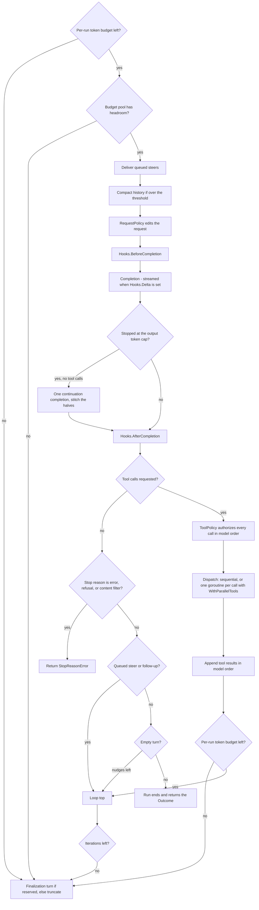

# The agent loop

`llmkit/agent` is a tool-call execution harness. A `Runner` drives an `llmkit.Client` through a bounded set of tools. The run ends when the model produces a final answer, runs out of iterations, or exhausts a token budget.

You construct one `Runner` per agent role (a coder, a reviewer, a researcher) with that role's system prompt and tool set. Then call `Run` per task. The harness speaks only the normalized [llmkit](../README.md) vocabulary, so the same loop works with every [provider](providers.md). The API reference is canonical: see [pkg.go.dev/github.com/dpoage/llmkit/agent](https://pkg.go.dev/github.com/dpoage/llmkit/agent).

## One turn of the loop



The loop counts one turn per model completion. A turn's number is its iteration count and its transcript `Step`; continuation, finalization, and repair completions each take the next number. The checks at the loop top run in this order: iteration cap, per-run token budget, shared budget pool. A run that fails a check stops cleanly with a truncation reason, not an error. Steering delivery sits below those checks, so a limit stop leaves queued turns undelivered.

## Tools

A `Tool` is one capability the model may invoke. The harness advertises every tool's declaration to the model and dispatches matching tool calls to `Tool.Run`. Build one with `agent.Func`: the struct argument is the JSON Schema, so the schema and the decoding code cannot drift apart.

```go
type weatherArgs struct {
	City string `json:"city" jsonschema:"description=the city to look up"`
}

weather := agent.Func("weather", "look up the current weather for a city",
	func(_ context.Context, a weatherArgs) (string, error) {
		return "18°C, clear", nil
	})
```

A tool error is not a loop failure. The harness feeds it back to the model as a tool result prefixed `ERROR:`, and the model retries, tries another tool, or gives up. A panic inside `Tool.Run` is recovered and rendered the same way, in both dispatch modes. Reserve errors for tool-level problems; never use them to abort the loop.

Use `ToolHealthError` when the failure is infrastructure (a missing container runtime, a crashed language server) rather than model-recoverable data. The harness still feeds the text back to the model, and it also fires `Hooks.ToolHealth` so you can rank impact.

Tools run one call at a time by default. `WithParallelTools` runs a turn's calls concurrently. Concurrent `Run` calls on one Runner are always allowed. A `Tool.Run` implementation must therefore be safe for concurrent calls.

When to use: give the model capabilities it cannot have on its own — read files, call APIs, run queries. Implement the two-method `Tool` interface when the schema is not a plain struct; use `Func` otherwise. Decode arguments inside a hand-written `Tool.Run` with `agent.UnmarshalArgs`.

## Limits and outcomes

`WithLimits(agent.Limits{...})` bounds a run. The zero value resolves to the package defaults.

| Field | Zero value | Negative value |
|---|---|---|
| `MaxIterations` | `DefaultMaxIterations` (20 model turns) | disables the cap |
| `TokenBudget` | `DefaultTokenBudget` (1,000,000 tokens) | disables the budget |
| `CacheReadWeight` | 1.0 (no discount) | treated as 1.0 |
| `HistoryTokenBudget` | 0 (compaction off) | also off |

A limit stop is data, not an error. `Run` returns an `Outcome` with a non-empty `TruncationReason` (`TruncMaxIterations`, `TruncTokenBudget`, or `TruncBudgetPool`) and the text of the last completion in `FinalText`. Other failures do return an error; the table under [What Run returns](#what-run-returns) lists them all.

`HistoryTokenBudget` turns on threshold-triggered compaction. When the estimated history size (bytes/4) crosses the threshold, the Runner replaces old tool results with short stubs. It keeps the most recent few results intact. The threshold then re-arms higher. Compaction mutates the prompt prefix, so each firing costs one cache miss; the re-arm bounds how often that happens.

When to use: set `MaxIterations` for bounded exploration, `TokenBudget` for spend control, and `HistoryTokenBudget` on long tool-heavy runs whose history outgrows the model's context window. Check [capabilities](capabilities.md) for the model's window before sizing it.

## Policies

Two single-method interfaces sit between the model and the world. Each has a `Func` adapter, so a policy written for one harness works in another.

### RequestPolicy

`WithRequestPolicy` edits every outgoing request: the main loop turn, the max-tokens continuation turn, the forced-finalization turn, and the `RunJSON` repair turn. The policy runs before `Hooks.BeforeCompletion`, and the transcript records the post-policy request.

```go
runner := agent.NewRunner(client, nil, "Answer briefly.",
	agent.WithRequestPolicy(agent.RequestPolicyFunc(
		func(_ context.Context, _ int, req *llmkit.Request) error {
			req.MaxTokens = 128
			return nil
		})),
	agent.WithHooks(agent.Hooks{
		BeforeCompletion: func(_ context.Context, _ int, req *llmkit.Request) {
			maxTokensOnWire = req.MaxTokens // observes the edited request
		},
	}))
```

`req.Messages` is a shallow clone of the loop's history. A policy can filter, append, or reorder messages for this turn only; the loop's history stays unchanged. Every other field — `Thinking`, `Temperature`, `ToolChoice`, `StopSequences`, `TopP`, `TopK`, `Seed` — is the policy's to set, gated by [capabilities](capabilities.md) at the wire. A non-nil error aborts the run before the wire call, wrapped as `agent: request policy at iteration <step>: ...`.

When to use: pin sampling parameters or reasoning budgets per call, redact messages before they leave the process, or force a tool choice.

### ToolPolicy

`WithToolPolicy` authorizes every tool call of a turn, in model order, on the loop goroutine, before any `Tool.Run` starts — in both dispatch modes. Under `WithParallelTools`, an interactive policy therefore never overlaps tool execution.

```go
policy := agent.ToolPolicyFunc(func(_ context.Context, call *llmkit.ToolCall) error {
	if call.Name == "delete_file" {
		return errors.New("deletes require manual approval")
	}
	return nil
})

runner := agent.NewRunner(client, []agent.Tool{deleteFile}, "You manage files.",
	agent.WithToolPolicy(policy))
```

A denial feeds the model `ERROR: tool <name> denied: <err>` with `IsError` set, and the run continues. The model can react; the caller can audit. Only `call.Arguments` may be rewritten, and the conversation history keeps the model's original arguments, so the wire stays consistent with what the model asked for. `ToolStart`, `ToolEnd`, and `ToolHealth` do not fire for a denied call; the run's `tool_run` event records the denial as `denied: true` with `deny_reason` and an empty result — the rendered denial text rides the conversation, not the event.

When to use: guardrails. Allowlists and denylists, argument rewrites (constrain paths to a workspace), or a human approval step. To rewrite tool results, wrap the `Tool` instead.

## Hooks

`WithHooks` registers an observer struct with one optional callback per loop event. Every field is independent; a nil func is a no-op, and a zero `Hooks` value is valid.

| Hook | Fires |
|---|---|
| `BeforeCompletion` / `AfterCompletion` | around every completion, including continuation, finalization, and repair turns |
| `Delta` | once per stream fragment; the Runner streams via `llmkit.Stream` only when set |
| `ToolStart` / `ToolEnd` | around each `Tool.Run` |
| `ToolHealth` | when a tool returns a `*ToolHealthError` |
| `Compaction` | when compaction actually pruned history |
| `Repair` | at the start of a `RunJSON` repair pass |
| `Finalize` | when the reserved finalization turn is taken |

Hooks run synchronously, inline on the goroutine that reaches the fire point. Every hook family reports the same 1-based step for a turn: `ToolEvent.Step`, `CompactionEvent.Step`, and the `step` the Runner stamps on the run's `llmkit.Event` values. Consumers join on it. A repair turn continues the numbering.

```go
agent.WithHooks(agent.Hooks{
	ToolEnd: func(_ context.Context, ev agent.ToolEvent) {
		fmt.Printf("step %d: %s -> %s\n", ev.Step, ev.Call.Name, ev.Result)
	},
})
```

A panicking hook is a harness bug: it propagates out of `Run` in both dispatch modes and is never rendered to the model. Hook functions must be safe for concurrent use under `WithParallelTools` or concurrent `Run` calls.

When to use: stream tokens to a UI with `Delta`, log tool activity, collect metrics, or record tool-health signals.

## Steering

`NewSteering` returns a handle; `WithSteering` binds it to a run. `Steer` queues a user turn that delivers before the next model call, after the current turn's tool results. `FollowUp` queues a user turn that delivers when the run would otherwise finish — and the loop continues instead of ending.

```go
steering := agent.NewSteering()
steering.FollowUp(llmkit.Text("Make it shorter."))

outcome, err := runner.Run(ctx, "Write a tagline.", agent.WithSteering(steering))
```

Delivered turns are ordinary user messages: the transcript records them, and `Outcome.Messages` includes them. Limits apply unchanged, so a limit stop leaves turns queued; `Pending` reports the count, and `Continue` with the same handle delivers them on the continued run. A refusal stop returns before the would-be-finish drain, so queued turns stay pending. A steer already queued delivers at the pre-completion boundary, before the refusing completion. A second concurrent run on one handle fails that run with `ErrSteeringInUse`.

When to use: human-in-the-loop corrections, mid-run priority changes, or a REPL (read–eval–print loop) that keeps talking to a working agent.

## Structured output

`RunJSONAs` asks the model for a JSON answer that matches the schema of a Go type. It deep-validates the answer against that schema and returns the decoded value.

```go
type tripAnswer struct {
	City string `json:"city" jsonschema:"description=destination city"`
	Days int    `json:"days" jsonschema:"description=trip length in days"`
}

answer, outcome, err := agent.RunJSONAs[tripAnswer](ctx, runner, "Plan a 3-day trip to Paris.")
```

`Runner.RunJSON` is the raw form: it takes a hand-written JSON Schema and an `out` pointer. Both variants embed the schema in the prompt and, when the client reports the `StructuredOutput` [capability](capabilities.md), also send it on the wire for grammar-constrained decoding. If the answer fails to parse or violates the schema, the Runner makes one repair round-trip: it sends the precise error back and asks for valid JSON only. If the repair still fails, the error wraps `ErrUnparseableOutput`. A run already stopped by the token budget or a budget pool skips the repair; it fails immediately, and the `Outcome` keeps the budget `TruncationReason`. `RunJSON` also reserves the last iteration for a forced-finalization turn, so a capped run still gets the chance to emit its answer.

When to use: any caller that needs a machine-readable answer — extraction, routing, scoring, and phase hand-offs between agents.

## Budgets

`NewBudgetPool` creates a token budget shared across concurrent Runner runs. A Runner installed with `WithBudgetPool` checks the pool once per loop turn and charges it after each success, discounted by `CacheReadWeight`. Continuation, finalization, and repair completions are charged without a fresh check. An exhausted pool stops a run cleanly with `TruncBudgetPool`. One final turn per run can land after the ceiling, so real spend can modestly overshoot. A nil pool is the default and means unlimited.

When to use: cap the total spend of a fan-out (many runners, one ceiling) without giving each run its own allowance. Record external spend against the same ceiling with `BudgetPool.Add`.

## Transcripts, observers, and replay

Every run emits `llmkit.Event` values through one observer chain: the in-memory `agent.Transcript` first (it always exists and backs `Outcome.Transcript`), then the single durable sink installed with `WithObserver` — `agent.JSONL(dir, onErr)` streams one JSON line per event to a file per run. The chain is built with `llmkit.Observers`, and the events are the same ones bare clients see; a Runner already emits the `completion` event for every completion it makes, so never wrap a Runner's client with `llmkit.Observe` — that would double it.

Each event carries `run_id` (minted per run, or pinned with the `WithRunID` run option), `schema_version`, and — on Runner-emitted kinds — the 1-based turn as `step`. A run continued with `Continue` stamps `parent_run_id` on every event, so a sink can reconstruct the whole lineage. Decorator-emitted kinds this table does not list — a provider `attempt`, and the `decision`/`embed`/`exec` events a tool's decorators emit — carry the same enclosing turn as `step` when they fire inside a Runner turn: the Runner places the turn in the context (`llmkit.WithStep`) those emitters read.

| Kind | Step | Records |
|---|---|---|
| `start` | 0 | the task text and the tool names offered; `parent_run_id` rides here on continued runs |
| `completion` | turn | the full request–response round-trip (post-policy request, response, usage) or the failure as `err`; one per model turn, span-joined to any provider attempts |
| `tool_run` | turn | the model's call, the result verbatim as fed to the model; `Denied` + `deny_reason` for policy denials, `is_error` for failures |
| `compaction` | next turn | token totals before/after and the prune count; only when something was actually pruned |
| `steer` | next turn | a delivered steering message; `follow_up` marks follow-up turns |
| `finalize` | completed turns | why the run stopped (`truncation_reason`), total usage, the run's answer (`final_text`), whether forced finalization fired; the completed-turn count is the `step` itself; emitted on every run end, including error returns; a failed completion does not advance the step, so a run whose only completion failed reports step 0 |

A real recorded run (weather tool, two turns) looks like this — timestamps and ids are the only things that change between runs:

```jsonl
{"kind":"start","run_id":"1789959179957-87bc7f41b8d43814","time":"2026-09-21T02:52:59.957895422Z","schema_version":1,"start":{"task":"What is the weather in Tokyo?","tools":["weather"]}}
{"kind":"tool_run","run_id":"1789959179957-87bc7f41b8d43814","step":1,"time":"2026-09-21T02:52:59.958326838Z","schema_version":1,"tool_run":{"call":{"id":"call-1","name":"weather","arguments":{"city":"Tokyo"}},"result":"18°C, clear"}}
{"kind":"finalize","run_id":"1789959179957-87bc7f41b8d43814","step":2,"time":"2026-09-21T02:52:59.958376321Z","schema_version":1,"finalize":{"usage":{"input_tokens":1294,"output_tokens":36},"final_text":"Tokyo is 18°C and clear."}}
```

The omitted `completion` lines each carry the full request–response round-trip under `completion.request` / `completion.response`, which is what replay reads. The file name is exactly `<RunID>.jsonl` — one RunID is one file, created exclusively at the run's `start` event and closed at its `finalize` — so pin the id with `WithRunID` when a caller generates stable identifiers up front and must recover the exact file later. The id must be a safe filename component: non-empty, not `.` or `..`, no path separators, no NUL. A leftover file, a second Start for an id this sink already admitted (live, refused, or poisoned), or an unsafe id is refused through `onErr` and that run's events are dropped; a single record holding two runs does not read back. Admission, the exclusive create and that first `start` line are one step under one lock, so a record is never created and then left empty; and because the file outlives the run's admission state, a second run can never take an id some run already recorded — it is refused as a leftover, which is what keeps one run's events out of another's record. The sink is best-effort: it never fails a run, and every failure flows to the `onErr` callback given at construction. Calling `WithObserver` twice is last-wins: a Runner has exactly one durable sink.

`Transcript.SaveJSONL` and `LoadJSONL` serialize the in-memory view; every `LoadJSONL` line must be a valid `llmkit.Event` (`Event.Validate`'s rule: a known kind carrying exactly its own payload, and a non-zero `schema_version`) or the load errors naming the line. The rule is forward-compatible on the version — a future `schema_version` still loads — but not on kinds: one unknown kind fails the whole load, since a kind this build cannot name cannot be decoded safely. Both read sides meet at one interface:

```go
type Source interface {
	Events(ctx context.Context, run llmkit.RunID) ([]llmkit.Event, error)
}
```

`Transcript` and the `JSONL` sink both implement it; `store/sqlite` joins them in a later round. Both return a slice the caller owns, both fail with `ErrUnknownRun` for a run they have no record of, and the sink's read side refuses an id that is not a safe filename component. Read a JSONL run once it has finalized: the sink streams a line per event and nothing synchronizes a read against a write in flight, so a read that races an append can decode a torn last line and fail. Replay consumes `completion` events only (never attempts): `NewReplayClient(src, run, caps)` serves the recorded responses with tool-call structure validation, and its `Tools()` method returns one `Tool` per recorded name, bound to the client, serving the recorded results instead of executing — a fully offline replay with zero live tool executions, deterministic under `WithParallelTools`. Divergence is state owned by the client, never guessed from message text: a call that matches nothing, a structure mismatch, or an exhausted record wraps `ErrReplayDiverged` naming the recorded step, and `Complete` refuses to serve past it. A divergence in the run's final tool turn can end the run before another `Complete`, so assert `Err() == nil` after every replayed run:

```go
rc, err := agent.NewReplayClient(src, runID, llmkit.Capabilities{})
if err != nil {
	return err
}
replayed, err := agent.NewRunner(rc, rc.Tools(), "sys").Run(ctx, "task")
if err != nil {
	// a mid-run divergence fails Run with an ErrReplayDiverged error
	return err
}
if err := rc.Err(); err != nil {
	// a divergence in the run's final tool turn surfaces only here
	return err
}
_ = replayed
```

When to use: record a run once, then replay it deterministically against modified harness code — the building block for offline evaluation. `EstimateHistoryTokens` and `SimulateCompaction` export the compaction decision so replay tooling reproduces it exactly.

## Options

Constructor options apply to every run of a Runner; run options apply to a single `Run` call and can differ per call.

| Option | Default when not set |
|---|---|
| `WithLimits(l Limits)` | zero fields resolve to the package defaults |
| `WithMaxTokens(n int)` | zero uses the adapter default |
| `WithHooks(h Hooks)` | zero `Hooks`: every callback is a no-op |
| `WithParallelTools()` | sequential dispatch within a turn |
| `WithToolTimeout(d time.Duration)` | zero: no per-tool deadline |
| `WithBudgetPool(pool *BudgetPool)` | nil pool: unlimited, no check, no charge |
| `WithRequestPolicy(p RequestPolicy)` | nil policy: the request goes out as built, no clone |
| `WithToolPolicy(p ToolPolicy)` | nil policy: every call is allowed |
| `WithObserver(obs llmkit.Observer)` | nil: no durable sink; last-wins, one sink per Runner |
| `Attach(blocks ...llmkit.Block)` (run) | no blocks: the plain text task turn; repeated calls accumulate |
| `Continue(prev *Outcome)` (run) | nil or empty `prev`: the run reseeds from `task`; else `ParentRunID` = `prev.RunID` |
| `WithRunID(id llmkit.RunID)` (run) | empty: the Runner mints one with `llmkit.NewRunID` |
| `WithSteering(s *Steering)` (run) | nil handle: no steering |

## What Run returns

`Run` returns `(*Outcome, error)`. The `Outcome` is non-nil even on error, and its `Transcript` captures everything up to the failure.

| Value | Meaning |
|---|---|
| `*StopReasonError` | the model's final turn ended with `StopError`, `StopRefusal`, or `StopContentFilter` and no tool calls. `Text` carries the refusal prose — never present it as the answer. Thread `err.Outcome` into `Continue` to keep the conversation going. |
| `error` wrapping `ErrUnparseableOutput` | (`RunJSON` / `RunJSONAs` only) the final answer did not parse or violated the schema. The Runner repairs once; a run stopped by the token budget or a budget pool skips the repair and fails immediately, keeping the budget `TruncationReason` in the `Outcome`. |
| `ErrSteeringInUse` | the `Steering` handle is already bound to another active run |
| context error (`context.Canceled`, `context.DeadlineExceeded`) | the run's context ended the run; the partial `Outcome` is still returned |
| `agent: completion failed at iteration <step>: ...` | the client call failed (transport, provider error); the underlying error is wrapped |
| `agent: request policy at iteration <step>: ...` | the `RequestPolicy` aborted the run before the wire call; nothing is recorded for that step |
| `nil` error with `TruncationReason` set | a clean limit stop: `TruncMaxIterations`, `TruncTokenBudget`, or `TruncBudgetPool` |

`ErrBudgetExhausted` is the `BudgetPool.Check` failure; the Runner converts it into the `TruncBudgetPool` stop, so `Run` itself does not return it. `ToolHealthError` is likewise never returned: it reaches `Hooks.ToolHealth` while the harness feeds the same text to the model as tool data.

## Where to go next

Build the client with a provider profile from [providers](providers.md), check what each capability gates in [capabilities](capabilities.md), and keep [pkg.go.dev/github.com/dpoage/llmkit/agent](https://pkg.go.dev/github.com/dpoage/llmkit/agent) open as the contract reference.
