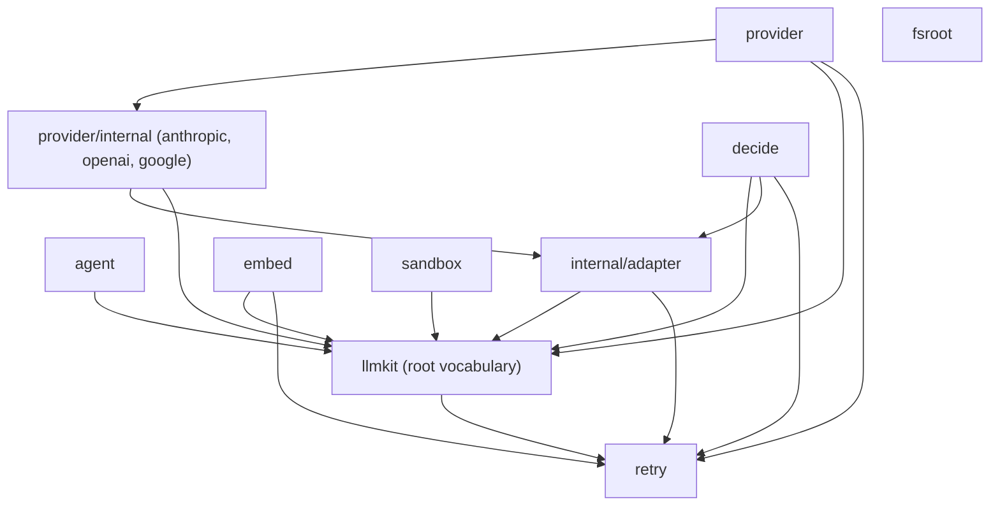

# Design

This page records the architecture and one decision per choice, with the cost
of each. Tutorials live in the other [docs pages](README.md); the API
reference is [pkg.go.dev](https://pkg.go.dev/github.com/dpoage/llmkit).

## The layering

Eight packages face the caller; the vendor adapters do not. The import graph
is a DAG, `retry` is its only shared leaf, and nothing imports upward:

`retry` and `fsroot` import no other kit package. `retry` holds the
backoff loop: `retry.Config`, `retry.Do`, and `retry.ParseRetryAfter`.
The root package, the adapter layer, `provider`, `embed`, and `decide`
all import it directly. `embed` imports the root vocabulary and
`retry`; `decide` imports the root vocabulary, `internal/adapter` for
status classification, and `retry`.
Neither goes through `provider`. `agent` drives any `llmkit.Client`, so a
`Runner` runs against a provider client, a replay client, or your own
implementation. The diagram omits test-only packages: `internal/livetest`
backs the `live` acceptance suite.

## One normalized vocabulary

The root package defines the whole wire vocabulary: `Message` and `Block`,
`Request` and `Response`, `Usage`, `Capabilities`, the sentinel errors, and
the decorators. Four provider types map onto it: Anthropic, OpenAI, Google,
and any OpenAI-compatible endpoint.

- **What it buys:** caller code is provider-free. A request, a capability
  probe, and an `errors.Is` check read the same for every backend.
- **What it costs:** a vendor-specific parameter waits for a normalized
  field, or travels as an adapter-specific path instead.

## Adapters are internal

The vendor-SDK adapters live under `provider/internal/{anthropic,openai,
google}`. `provider.New` is the only construction path; its package doc
states the rule: it is "the single construction entry point, so Spec
validation cannot be bypassed" (`provider/provider.go`).

- **What it buys:** every client passes the same gate. Credential rules,
  spec validation, and the decorator stack apply to all adapters, and an
  adapter rewrite is never an API break.
- **What it costs:** construction flexes only through `Spec` and `Options`.
  A need outside them is a provider-package change, not caller code.

## One synchronous client, streaming as synthesis

`Client` is one method, `Complete(ctx, Request) (Response, error)`, plus
`Capabilities()`. A client that can also stream implements
`StreamingClient`. `llmkit.Stream` accepts any client: it delegates to the
native stream when one exists and otherwise calls `Complete` and synthesizes
deltas from the response (`stream.go`).

- **What it buys:** callers never special-case a non-streaming backend, and
  the three decorators wrap both paths with the same semantics.
- **What it costs:** synthesized streams deliver in whole-response chunks,
  not token by token. A UI that needs token pacing needs a native stream.

## Decorator order: serialize, then record, then retry

`provider.New` wraps every adapter the same way, outer to inner:
`serialize -> recorder -> retry -> adapter` (`provider/provider.go`).

The order fixes who sees what. The tool-call serializer truncates a
multi-call response to one before your loop sees it. The recorder books usage
only for the final successful attempt. The retry wrapper sees raw adapter
errors, so its classification and `Retry-After` handling stay accurate —
and it is the only layer that sees attempt boundaries, which is why
`Options.Observer` wires its Attempt events there: one event per wire call,
failures included, joined to the completion's span.

- **What it buys:** each wrapper has one job and one viewpoint; usage is
  never double-counted across attempts, and a sink can watch per-attempt
  flakiness without double-counting spend.
- **What it costs:** the order is fixed. `New` never emits `Completion`
  events — the outermost layer owns those: the agent Runner for agent runs,
  or wrap the returned client with `llmkit.Observe` for bare clients (never
  both for the same client). And because Attempt events sit below the
  serializer, a sink correlating them with the Completion must account for
  the truncation itself: the Attempt carries the raw response, the
  Completion the truncated one your loop sees.

## Honest capabilities

`Client.Capabilities()` reports a `Capabilities` profile for the
provider-plus-model pair. Every field belongs to one of four enforcement
classes: dropped silently, refused pre-wire, decorator, or advisory. No
adapter fabricates a context window; an unknown model reports `0`.

- **What it buys:** one profile answers "what happens if I send this". A
  refusal is an error before the wire call; a drop is visible in the profile.
- **What it costs:** callers read the profile instead of assuming support.
  See [capabilities](capabilities.md) for the per-field table.

## Vendor SDKs, not hand-rolled wire types

The adapters drive `anthropic-sdk-go`, `openai-go`, and Google's `genai` SDK.

- **What it buys:** wire formats, auth headers, and server-sent events (SSE)
  parsing track the vendors. llmkit normalizes at the edges and never
  re-implements a protocol.
- **What it costs:** dependency weight in `go.mod`, and a vendor SDK defect
  becomes our defect until the pin moves.

## Policy seams are single-method interfaces

`agent` keeps policy out of the loop. `RequestPolicy` edits each wire
request; `ToolPolicy` allows, denies, or rewrites each model-requested tool
call. Each seam is one method with a `Func` adapter, so a policy is a closure
when you want one and a type when you need state.

- **What it buys:** policies compose, test, and port; the loop stays
  ignorant of any specific guardrail.
- **What it costs:** cross-cutting rules span two seams. A rule about both
  requests and tools needs two policies or a `Tool` wrapper.

## Observability and replay

Every nondeterministic boundary — a completion, a provider retry attempt, a
tool run, a compaction pass, a steering injection, run finalization, a
decision, an embedding, a sandbox execution — emits one typed `llmkit.Event`
to an `llmkit.Observer`, a single-method data sink. A `RunID` minted per run
rides the context (`llmkit.WithRun`), so tool implementations, policies, and
decorators stamp the same correlation key the runner does. The turn
number rides the context the same way (`llmkit.WithStep`), so events
decorators emit inside a Runner turn — retry attempts, decisions, sandbox
executions — join the Runner's own events on `step`;
`FinalizeEvent.FinalText` likewise records the run's stitched answer so a
store persists it without re-deriving the stitch. Replay reads the
same stream back: a Completion event carries the full request/response
round-trip, which is why deterministic replay consumes Completion events
only.

The emission rule keeps the record honest: a Completion event is emitted
exactly once per logical completion by the outermost harness layer — the
agent Runner (with its Step) or, for bare clients, the `llmkit.Observe`
decorator — never both. Attempt events come only from inside the provider
retry stage, so a sink can see flakiness without double-counting spend.
Policy denials are ToolRun events with `Denied` set, not a separate kind:
what happened at the boundary is one fact with one shape.

Attempts join their Completion on a span id, not a time window: the
Completion emitter mints a fresh `SpanID` per logical completion and puts
it in the context it passes to the client, so concurrent or nested
completions (a tool calling the model) stay separable in the record.

A run has exactly ONE durable sink. JSONL transcripts and a SQLite store
never coexist as a split history of the same run (user ruling, 2026-09-20):
the transcript is a view of the event stream, not a second record, and the
Runner's in-memory `Outcome.Transcript` stays that same view, not a store.
Sinks that fan out compose through `llmkit.Observers`, but at most one of
them is durable.

- **What it buys:** one correlation key and one wire shape across five
  components; offline replay and evaluation from any sink; a panicking
  observer is visible as a harness bug instead of silently dropping data.
- **What it costs:** event fields are contract — a rename changes every
  sink's format, so the per-kind wire shapes are pinned by golden-literal
  tests. `llmkit.Recorder` stays the usage-ledger hook for now; folding it
  into the Observer stream is deferred because the cutover touches
  provider, decide, embed, and bugbot in one change.

## The observation vocabulary lives in the root package

`Observer`, `Event` with its ten payload types, and the run/span/step
identity that rides the context are declared in `llmkit` itself, not in a
`llmkit/observe` leaf package. Moving them was measured before the question
was closed: ~610 occurrences of the event vocabulary's 28 counted symbols —
observe.go's 27 exported declarations plus the `Event.Validate` method —
in comment-stripped Go code across root, agent, provider (adapters
included), embed, and sandbox; tests included, which is most of the
weight, because the suites pin the vocabulary; ~140 excluding tests. The
counted set is narrower than this section's own definition of the
vocabulary: adding the run/span/step identity it names (`RunID`, `SpanID`,
`WithRun`, `RunFromContext`, `WithSpan`, `SpanFromContext`, `WithStep`,
`StepFromContext`, `NewEvent`, and `EventSchemaVersion` from run.go)
spans 38 symbols and measures ~1120 with tests, ~250 without, under the
same rule — the decision is insensitive to the counting rule. (`decide`
contributes zero in every variant: it sits on the `Recorder` seam, and
becomes an Observer consumer only if the deferred Recorder fold-in
happens.)

The decisive reason a leaf cannot work is the direction of the type
dependency, not taste. The payloads embed root's own wire types —
`CompletionEvent` carries a `Request` and a `Response`, `AttemptEvent`
too, `ToolRunEvent` a `ToolCall`, `SteerEvent` a `Message`,
`EmbedEvent` and `DecisionEvent` a `Usage` — so a `llmkit/observe` leaf
would have to import root. Root's `Observe`, `WithRetryObserver`, and
`Observers` construct and carry `Event`, so root would have to import the
leaf. The leaf can only sit above root, and then most consumers (sandbox
is the exception: its entire llmkit surface is the event vocabulary) import
two packages for one vocabulary. `llmkit/retry` is the extracted-package
counterexample that works, and shows the difference: `retry` is
self-contained (root imports it; it imports no kit package), so extracting
it costs nothing. The event vocabulary has no such cut to extract along —
every payload is root's wire types re-exposed.

- **What it buys:** most components that emit or persist events — agent,
  provider, embed, and the future store (sandbox touches only the event
  vocabulary itself) — speak one event shape from the package they already
  import for `Request`/`Response`; no sink
  translates between vocabularies and no store imports the agent loop to
  read its telemetry.
- **What it costs:** the root package now carries agent-shaped kinds —
  start, compaction, steer, finalize — beside the wire vocabulary, so the
  package that documents the client's provider-free surface also holds the
  loop's concepts. A reader looking for only the client vocabulary finds
  run bookkeeping next to it.

## The sandbox refuses; it never drops

`sandbox.Spec` is honest per backend. A field a backend cannot honor fails
`Exec` with an `UnsupportedSpecError` naming the backend, the field, and the
value. No backend silently runs a weaker posture than the spec requested.
See [sandbox](sandbox.md) for the honor matrix and the threat model.

- **What it buys:** a run's verdict is trustworthy. A refused network mode
  cannot masquerade as an isolated one.
- **What it costs:** portability work lands on the caller. Cross-backend
  callers probe or branch on what each backend honors.

## fsroot and sandbox defend different boundaries

`sandbox` confines a running process: what the command can see and write
while it runs. `fsroot` confines tool arguments: whether a caller-supplied
relative path stays inside a root. The packages share no code on purpose.

- **What it buys:** each threat model stays small. Symlink-hardened writes
  protect the workspace; `Resolve` protects the tool layer before a command
  exists.
- **What it costs:** an agent that runs commands in a workspace uses both,
  and must wire them together itself.

## embed stays dependency-light

`embed` offers two HTTP backends: Ollama and OpenAI-compatible. It uses
`retry.Do` and a content-hash least-recently-used (LRU) cache. Local
Open Neural Network Exchange (ONNX) inference is deliberately excluded;
it would drag the ONNX and GoMLX dependency trees.

- **What it buys:** a small dependency tree for the common case: call a
  serving endpoint, cache the vectors.
- **What it costs:** local inference is the application's job. Implement
  `Embedder` in your app if you need it.

TypeSafe's Jev is a decision model. One request carries a state plus typed
questions (`Noul`, `Choice`, `Score`), and the answer is a belief or a
probability distribution. Because Jev has no messages, no tools, no
streaming, and no text output, `decide` does not implement `llmkit.Client`
and does not go through `provider.New`. `decide.New` is its own validated
construction path. `embed` is the precedent for a non-chat sibling
package.

- **What it buys:** an honest surface. A decision answer cannot masquerade
  as chat text, and no `Capabilities` field lies about streaming or tools.
  Callers share the common vocabulary where it fits: the sentinel errors,
  `retry.Config`, `Usage`, and the recorder. The retry loop lives in one
  place: `retry.Do`.
- **What it costs:** a second construction path outside the `provider.New`
  gate. Code that targets `llmkit.Client` cannot take a `decide` client.
  The two surfaces share errors and usage, not a request type.

## How it is tested

The default suite is hermetic: no network, no credentials, no backends.
Recorded vendor fixtures replay hermetically in every plain `go test ./...`,
and the `live`-tagged acceptance suite runs the same cases against real
vendors. A registry test fails the plain suite when a `Capabilities` field
has no live case. The commands and skip rules are in
[testing](testing.md).
