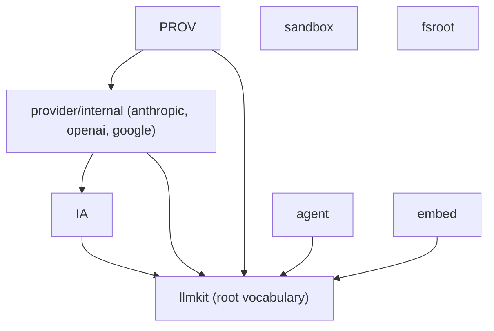

# Design

This page records the architecture and one decision per choice, with the cost
of each. Tutorials live in the other [docs pages](README.md); the API
reference is [pkg.go.dev](https://pkg.go.dev/github.com/dpoage/llmkit).

## The layering

Six packages face the caller; the vendor adapters do not. The import graph
is a tree rooted at the `llmkit` package, and nothing imports upward:

`sandbox` and `fsroot` import no other kit package. `embed` imports only the
root, for `RetryConfig`. `agent` drives any `llmkit.Client`, so a `Runner`
runs against a provider client, a replay client, or your own implementation.

## One normalized vocabulary

The root package defines the whole wire vocabulary: `Message` and `Block`,
`Request` and `Response`, `Usage`, `Capabilities`, the sentinel errors, and
the decorators. Four provider types map onto it: Anthropic, OpenAI, Google,
and any OpenAI-compatible endpoint.

- **What it buys:** caller code is provider-free. A request, a capability
  probe, and an `errors.Is` check read the same for every backend.
- **What it costs:** a vendor-specific parameter waits for a normalized
  field, or travels as an adapter-specific path instead.

## Adapters are internal

The vendor-SDK adapters live under `provider/internal/{anthropic,openai,
google}`. `provider.New` is the only construction path; its package doc
states the rule: it is "the single construction entry point, so Spec
validation cannot be bypassed" (`provider/provider.go`).

- **What it buys:** every client passes the same gate. Credential rules,
  spec validation, and the decorator stack apply to all adapters, and an
  adapter rewrite is never an API break.
- **What it costs:** construction flexes only through `Spec` and `Options`.
  A need outside them is a provider-package change, not caller code.

## One synchronous client, streaming as synthesis

`Client` is one method, `Complete(ctx, Request) (Response, error)`, plus
`Capabilities()`. A client that can also stream implements
`StreamingClient`. `llmkit.Stream` accepts any client: it delegates to the
native stream when one exists and otherwise calls `Complete` and synthesizes
deltas from the response (`stream.go`).

- **What it buys:** callers never special-case a non-streaming backend, and
  the three decorators wrap both paths with the same semantics.
- **What it costs:** synthesized streams deliver in whole-response chunks,
  not token by token. A UI that needs token pacing needs a native stream.

## Decorator order: serialize, then record, then retry

`provider.New` wraps every adapter the same way, outer to inner:
`serialize -> recorder -> retry -> adapter` (`provider/provider.go`).

The order fixes who sees what. The tool-call serializer truncates a
multi-call response to one before your loop sees it. The recorder books usage
only for the final successful attempt. The retry wrapper sees raw adapter
errors, so its classification and `Retry-After` handling stay accurate.

- **What it buys:** each wrapper has one job and one viewpoint; usage is
  never double-counted across attempts.
- **What it costs:** the order is fixed. A caller cannot record every
  attempt, and the serializer cannot inspect post-retry results.

## Honest capabilities

`Client.Capabilities()` reports a `Capabilities` profile for the
provider-plus-model pair. Every field belongs to one of four enforcement
classes: dropped silently, refused pre-wire, decorator, or advisory. No
adapter fabricates a context window; an unknown model reports `0`.

- **What it buys:** one profile answers "what happens if I send this". A
  refusal is an error before the wire call; a drop is visible in the profile.
- **What it costs:** callers read the profile instead of assuming support.
  See [capabilities](capabilities.md) for the per-field table.

## Vendor SDKs, not hand-rolled wire types

The adapters drive `anthropic-sdk-go`, `openai-go`, and Google's `genai` SDK.

- **What it buys:** wire formats, auth headers, and server-sent events (SSE)
  parsing track the vendors. llmkit normalizes at the edges and never
  re-implements a protocol.
- **What it costs:** dependency weight in `go.mod`, and a vendor SDK defect
  becomes our defect until the pin moves.

## Policy seams are single-method interfaces

`agent` keeps policy out of the loop. `RequestPolicy` edits each wire
request; `ToolPolicy` allows, denies, or rewrites each model-requested tool
call. Each seam is one method with a `Func` adapter, so a policy is a closure
when you want one and a type when you need state.

- **What it buys:** policies compose, test, and port; the loop stays
  ignorant of any specific guardrail.
- **What it costs:** cross-cutting rules span two seams. A rule about both
  requests and tools needs two policies or a `Tool` wrapper.

## The sandbox refuses; it never drops

`sandbox.Spec` is honest per backend. A field a backend cannot honor fails
`Exec` with an `UnsupportedSpecError` naming the backend, the field, and the
value. No backend silently runs a weaker posture than the spec requested.
See [sandbox](sandbox.md) for the honor matrix and the threat model.

- **What it buys:** a run's verdict is trustworthy. A refused network mode
  cannot masquerade as an isolated one.
- **What it costs:** portability work lands on the caller. Cross-backend
  callers probe or branch on what each backend honors.

## fsroot and sandbox defend different boundaries

`sandbox` confines a running process: what the command can see and write
while it runs. `fsroot` confines tool arguments: whether a caller-supplied
relative path stays inside a root. The packages share no code on purpose.

- **What it buys:** each threat model stays small. Symlink-hardened writes
  protect the workspace; `Resolve` protects the tool layer before a command
  exists.
- **What it costs:** an agent that runs commands in a workspace uses both,
  and must wire them together itself.

## embed stays dependency-light

`embed` offers two HTTP backends, Ollama and OpenAI-compatible, with shared
retry and a content-hash least-recently-used (LRU) cache. Local Open Neural
Network Exchange (ONNX) inference is deliberately excluded; it would drag
the ONNX and GoMLX dependency trees.

- **What it buys:** a small dependency tree for the common case: call a
  serving endpoint, cache the vectors.
- **What it costs:** local inference is the application's job. Implement
  `Embedder` in your app if you need it.

## How it is tested

The default suite is hermetic: no network, no credentials, no backends.
Recorded vendor fixtures replay hermetically in every plain `go test ./...`,
and the `live`-tagged acceptance suite runs the same cases against real
vendors. A registry test fails the plain suite when a `Capabilities` field
has no live case. The commands and skip rules are in
[testing](testing.md).
