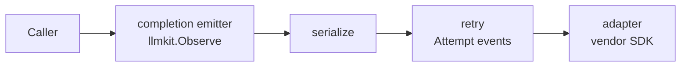

# Providers

The `provider` package is the single construction entry point for llmkit clients. Describe an endpoint with a `Spec`, tune the wrapper stack with `Options`, and call `provider.New`. This page shows one construction per provider type, the credential rules, and how errors normalize. See the [`provider` package reference](https://pkg.go.dev/github.com/dpoage/llmkit/provider).

## Constructing a client

Every construction follows the same shape:

1. Build a `provider.Spec` with the provider `Type`, the `Model`, and the resolved `Secret`.
2. Call `provider.New(ctx, spec, opts)`.
3. New validates the spec and returns a fully wrapped `llmkit.Client`.

New performs no network I/O. New reads three vendor-SDK base-URL environment variables (`OPENAI_BASE_URL`, `ANTHROPIC_BASE_URL`, `GOOGLE_GEMINI_BASE_URL`) and the Anthropic SDK profile files only to decide whether to refuse an empty `BaseURL`. The vendor SDKs still read their own environment variables at construction (the Google SDK logs a warning when both `GOOGLE_API_KEY` and `GEMINI_API_KEY` are non-empty), but no value from a vendor-SDK environment variable or profile file sets a request's host or a header, so construction is testable with placeholder credentials. An invalid spec returns an error wrapping `llmkit.ErrInvalidRequest`; the error never echoes the secret.

### Anthropic

```go
spec := provider.Spec{
	Type:   provider.TypeAnthropic,
	Model:  "claude-sonnet-4-5",
	Secret: os.Getenv("ANTHROPIC_API_KEY"),
}
client, err := provider.New(context.Background(), spec, provider.Options{})
```

No `BaseURL` targets the vendor default, `api.anthropic.com`.

### OpenAI

```go
spec := provider.Spec{
	Type:   provider.TypeOpenAI,
	Model:  "gpt-4o",
	Secret: os.Getenv("OPENAI_API_KEY"),
}
client, err := provider.New(context.Background(), spec, provider.Options{})
```

No `BaseURL` targets the vendor default, `api.openai.com/v1`.

### OpenAI-compatible (Ollama, vLLM, Groq, ...)

```go
spec := provider.Spec{
	Type:    provider.TypeOpenAICompatible,
	Model:   "llama3.1",
	BaseURL: "http://localhost:11434/v1", // required
	Secret:  "ollama",                    // placeholder is fine
}
client, err := provider.New(context.Background(), spec, provider.Options{})
```

`BaseURL` is required for this type. It has no vendor default, so an empty value would silently target first-party `api.openai.com/v1`. New refuses an empty `BaseURL` with an error wrapping `ErrInvalidRequest`.

The endpoint is often credential-less, so pass any non-empty placeholder as `Secret` — for example the string `"ollama"`. New checks only that the secret is present, not that the backend accepts it.

Because llmkit cannot know what the endpoint supports, this provider uses a conservative capability profile:

- no parallel tool calls
- no caching
- no structured output
- no thinking

Override the profile with `Spec.Capabilities` — see [capabilities](capabilities.md).

### Google

```go
spec := provider.Spec{
	Type:   provider.TypeGoogle,
	Model:  "gemini-2.5-flash",
	Secret: os.Getenv("GEMINI_API_KEY"),
}
client, err := provider.New(context.Background(), spec, provider.Options{})
```

No `BaseURL` targets the vendor default, `generativelanguage.googleapis.com`.

## Base URL rules

`Spec.BaseURL` overrides the endpoint for tests, proxies, and self-hosted gateways. Empty means the vendor default host. No SDK base-URL environment variable or profile file changes the host. `TypeOpenAICompatible` requires the field unconditionally — it has no vendor default.

For `TypeOpenAI`, `TypeAnthropic`, and `TypeGoogle`, `New` refuses an empty `Spec.BaseURL` when the vendor SDK would have taken the host from one of these sources:

- The Type's base-URL variable (`OPENAI_BASE_URL`, `ANTHROPIC_BASE_URL`, or `GOOGLE_GEMINI_BASE_URL`) is present in the process environment. An empty value counts as present.
- For `TypeAnthropic`, the Anthropic SDK profile file that `anthropic-sdk-go` would load has a `base_url`. The SDK looks for `configs/<profile>.json` in `ANTHROPIC_CONFIG_DIR`, else `$XDG_CONFIG_HOME/anthropic`, else `$HOME/.config/anthropic` outside Windows, else `configs/<profile>.json` relative to the current working directory when `HOME` is unset or empty and `XDG_CONFIG_HOME` is unset or empty, or when `ANTHROPIC_CONFIG_DIR` is present but empty. The profile is `ANTHROPIC_PROFILE` when that variable is non-empty (when it is present but empty, no profile is read), else the one the `active_config` file names, else `default`. The SDK reads no profile when `ANTHROPIC_API_KEY` or `ANTHROPIC_AUTH_TOKEN` is non-empty. When environment federation is fully configured, the SDK reads only a profile named by `ANTHROPIC_PROFILE` and skips the `active_config`-named and `default` profiles. `New` follows the same rules.

The error wraps `llmkit.ErrInvalidRequest`, names the variable or the profile file, and tells you to set `Spec.BaseURL`. Nothing is sent. To use the host the source names, set `Spec.BaseURL` to it. To reach the vendor default, remove the source.

## Credentials

`Spec.Auth` selects the credential mode:

| Mode | Wire form | Providers |
|---|---|---|
| `provider.AuthAPIKey` (zero value) | The provider's standard API-key credential: the `x-api-key` header on Anthropic, an `Authorization: Bearer` token on OpenAI and openai-compatible, the `x-goog-api-key` header on Google | All |
| `provider.AuthOAuthToken` | OAuth bearer token (the `Authorization` header) | Anthropic only |

New refuses `AuthOAuthToken` on any other type with an error wrapping `ErrInvalidRequest`. New also refuses any unrecognized `Auth` value. There is no silent fallback to API-key mode.

`Spec.Secret` must be a non-empty value with no leading or trailing whitespace. New refuses empty, whitespace-only, or whitespace-padded values. New never logs the secret.

## Environment conventions in examples/

The example programs under `examples/` read four variables through `examples/internal/envcfg`:

| Variable | Meaning |
|---|---|
| `LLMKIT_PROVIDER` | `anthropic`, `openai`, `openai-compatible`, or `google` (required) |
| `LLMKIT_MODEL` | model identifier, e.g. `claude-sonnet-4-5` (required) |
| `LLMKIT_API_KEY` | provider API key; any placeholder for a local endpoint (required) |
| `LLMKIT_BASE_URL` | endpoint override; required for `openai-compatible`, optional otherwise |

With the variables unset, an example prints its usage and exits without touching the network.

## The stack

`New` returns the adapter wrapped in `provider.Wrap`'s stack, outer to inner:



The stage order is the package's secret; one fact matters to callers: the retry stage sees raw adapter errors, so its classification and `Retry-After` handling stay accurate, and the outermost emitter sees the caller-visible (serialized) response.

With `Options.Observer` set, the retry stage emits one `Attempt` event per wire call, failures included, AND the outermost emitter emits one `Completion` event per logical completion the caller's context does not already belong to (see [`llmkit.BeginCompletion`](https://pkg.go.dev/github.com/dpoage/llmkit#BeginCompletion)) — so a `New`/`Wrap` client run under the agent `Runner` reports `Attempt` events only, the Runner's own `Completion` having already claimed the context.

The stack composes over streaming too: retry stops once a delta reaches the caller, and serialization drops tool-call deltas for any index beyond the first.

`Options` tunes the stack for both `New` and `Wrap`:

| Field | Effect | Default |
|---|---|---|
| `Retry` | Retry policy for the retry stage. Unset fields (≤ 0; `Jitter` == 0) are completed field-wise from `retry.Default` via `retry.Config.Or`; every field you set is kept — `Retry{BaseDelay: 2s}` sleeps a 2 s-based schedule, `Retry{MaxAttempts: 2}` keeps the 500 ms base. | `retry.Default` fills every unset field: 4 attempts, 500 ms base delay, 30 s cap, 20% jitter, 5 m per-attempt timeout |
| `Observer` | Receives one `llmkit.AttemptEvent` per provider attempt (failures included) from the retry stage, AND one `llmkit.CompletionEvent` per logical completion whose context the stack claims (a `New`/`Wrap` client run under the agent `Runner` sees an already-claimed context and receives `Attempt` events only), both tagged with the resolved `llmkit.Identity`. | nil (no events) |
| `Provider` | Overrides the `Identity.Provider` tag on emitted events. | `string(spec.Type)` for `New`; `llmkit.IdentityOf(c).Provider` for `Wrap` |
| `HTTPClient` | Overrides the transport the SDKs use; for `httptest` and proxies. Headers its `Transport` adds reach the wire. `Wrap` ignores this field — it decorates an already-built client and the inner adapter and its transport are kept: a `New` client built with HTTPClient `o1` keeps `o1` across every `Wrap`. | a plain `http.Client` per adapter over `http.DefaultTransport` (never `http.DefaultClient`); `Retry`'s per-attempt timeout bounds each attempt |

## Wrapping a foreign client

`provider.Wrap(c, opts)` puts the same stack around any `llmkit.Client` — the replacement for stacking root decorators by hand:

```go
wrapped := provider.Wrap(someClient, provider.Options{
	Retry:    retry.Config{MaxAttempts: 3},
	Observer: myObserver,
	Provider: "my-config-name",
})
```

Identity is `llmkit.IdentityOf(c)`, with `Provider` replaced by `Options.Provider` when set; a client with neither an `Identity()` method nor an explicit `Options.Provider` gets the zero identity (documented, not an error). `Wrap` is not like-for-like with the removed root retry decorator: it also serializes tool calls when the wrapped client's `ParallelToolCalls` capability is false, a step a caller retrying a foreign client by hand used to add separately.

`Wrap` is idempotent over its own stacks. Given a client `New` or `Wrap` returned, it rebuilds one stack from the client below it: the new `Options` apply (`Retry`, `Observer`, and `Provider` when set); the inner adapter and its transport are kept, and the rebuilt stack keeps the `Identity` it carried unless `Options.Provider` is set. `provider.Wrap(client, opts)` over a `New` client therefore makes at most `opts.Retry`'s resolved `MaxAttempts` wire calls per call, not the product of two retry schedules. A foreign decorator between the two stacks hides the inner one, and both retry.

Above its retry stage, the stack claims every call whose context is not already claimed, whether or not `Options.Observer` is set. An `llmkit.Observe` handed to `Wrap` is therefore silenced: `provider.Wrap(llmkit.Observe(c, obs), provider.Options{})` delivers no `Completion` event to `obs`, which drops out of the spend ledger. Pass `obs` as `Options.Observer` instead.

## Observing completions and attempts

Ownership decides who emits the `Completion` event. The rule has three parts (stated once, on `llmkit.Observer`): an emitter — `llmkit.Observe`, or a `New`/`Wrap` stack above its retry stage — mints a span and emits only when the context it receives carries no span, and passes the call through when the context already carries one; the agent `Runner` mints on the context it hands its client, on every turn; hooks and tools receive a context without the turn's span. A `New`/`Wrap` stack claims even without `Options.Observer`; it then emits no events at all, neither `Completion` nor `Attempt`. With `Options.Observer` set, a stack called directly emits both kinds, and a stack whose context is already claimed emits `Attempt` events only, on the enclosing span.

For a client this package did not build — a bare `llmkit.Client` you want to observe — wrap it with `llmkit.Observe(c, obs)` directly, outside any `Wrap` (see above); it follows the same rule. For a client a `Runner` runs, put the sink on the `Runner` with `agent.WithObserver`.

```go
spec := provider.Spec{Type: provider.TypeAnthropic, Model: "claude-sonnet-4-5", Secret: os.Getenv("ANTHROPIC_API_KEY")}
var events []llmkit.Event
obs := llmkit.ObserverFunc(func(ctx context.Context, ev llmkit.Event) {
	events = append(events, ev)
})
client, err := provider.New(ctx, spec, provider.Options{Observer: obs})
// client already emits one Completion event per call (because the
// New/Wrap stack owns the ctx above its retry stage and Options.Observer
// is set), plus its Attempt events — no extra llmkit.Observe wrap needed.
```

Because the observer's outermost stage sits above the serializer, a `Completion` event shows the truncated response your loop sees, while the retry stage's `Attempt` events show the raw adapter response.

If the same client runs inside an `agent.Runner`, the Runner is the emitter that owns the turn's `Completion` (with `Step` set, tagged with the client's `Identity`); `Options.Observer` still receives the `Attempt` events when set. An extra `llmkit.Observe` around a Runner-run client receives the context the Runner already claimed, so it never records a second `Completion`.

## Error normalization

Adapters map vendor failures onto the sentinel errors in `llmkit`; match them with `errors.Is` on the returned error. The `Kind` is derived from the HTTP status, with the response body disambiguating 400s:

| HTTP status / failure | `llmkit` kind | Retried by the retry stage |
|---|---|---|
| 429 | `ErrRateLimited` | Yes; carries `Retry-After` when the response supplies one |
| 401, 403 | `ErrAuth` | No |
| 413 | `ErrContextTooLong` | No |
| 400 with a context-length message ("prompt is too long", "context length", ...) | `ErrContextTooLong` | No |
| 400, other | `ErrInvalidRequest` | No |
| 529 | `ErrOverloaded` | Yes |
| Other 5xx (503 included) | `ErrServer` | Yes |
| Any other 4xx (404, 409, 422, ...) | `ErrInvalidRequest` | No |
| Google status below 400 (302 included) | `ErrServer` (genai exposes no vendor type) | Yes |
| In-band SSE error event on a committed 200 stream (Anthropic `error.type` / OpenAI body `error.type`) | classified by the vendor type, `StatusCode` 200 | `overloaded_error`/`server_error` → yes; `invalid_request_error` → no; unknown type → `ErrServer` (yes) |
| Transport failure (dial, reset, per-attempt timeout) | `ErrServer` with `StatusCode` 0, SDK error chained | Yes |
| Caller's context done (cancelled mid-call or during the retry backoff, or its deadline expired mid-attempt) | Adapters report a cancellation as a plain error chaining `context.Canceled`, never an `*llmkit.APIError`. When the caller's context is done as the retry stage returns, a retryable last error (a 503, or the `ErrServer` transport failure a caller deadline cuts short) is replaced by a plain error chaining `ctx.Err()` that carries its text; a terminal one (a 401, a stream callback's sentinel) is returned as-is | No — the result is never retryable under `llmkit.Classify` |

`Retry-After` is parsed on every status, not only 429/529: whenever a response carries the header and it parses, the error reports `HasRetryAfter` with `RetryAfter` set (a present zero means retry immediately). `llmkit.Classify` is the one retryability rule the table summarizes: cancellation first, then the retryable kinds `ErrRateLimited`/`ErrServer`/`ErrOverloaded`, everything else terminal.

Outcomes below 400 are body-parse-driven, not status-driven:

- Anthropic, OpenAI, and openai-compatible: a body that decodes as the vendor's completion object returns no error. A JSON error body decodes the same way; its error field is ignored. A body that fails to parse — empty, or an HTML page — returns an `ErrServer`-class error with status code 0, at any status including 200.
- Google: a non-2xx status at or above 400 returns the status-classified sentinel carrying that status; a status below 400 (302 included) returns `ErrServer` — retryable — because genai exposes no vendor type to classify by. A 200 with an unparseable body (HTML) returns an `ErrServer`-class error with status code 0; an empty 200 body returns no error.
- Anthropic SSE: a 200 stream that carries an `error` event classifies it in band by the event body's `error.type` (`overloaded_error` → `ErrOverloaded`, `invalid_request_error` → `ErrInvalidRequest`, unknown type → `ErrServer`), carrying the committed stream's `StatusCode` 200.
- OpenAI SSE: a `data:` line whose body carries an `error` object classifies the same way by `error.type`, also at `StatusCode` 200.

A refused pre-wire request (a `Capabilities` violation, a malformed block, an unknown role) also returns `ErrInvalidRequest` before any network call. See [capabilities](capabilities.md) for which profile fields refuse rather than drop. The `llmkit` package documentation lists the `APIError` fields.

Two `Retry-After` rules apply across the table.

First, the header is honored on every status that carries it, but only Anthropic and OpenAI can surface it: the Google SDK hides response headers, so Google errors report `HasRetryAfter` false and the retry stage falls back to exponential backoff. An OpenAI in-band error on a 200 stream is the same gap from the other side: the SDK's `StreamError` carries no headers, so no `Retry-After` surfaces there either.

Second, a `Retry-After` above `retry.Config.MaxDelay` is truncated to `MaxDelay` (30 s by default) — and jitter never pushes a backoff sleep past `MaxDelay` either.

The `decide` package parses `Retry-After` on every non-200 status and honors it on 429, any status 500 or above, and any non-200 status below 400. Its exact semantics are in [decide](decide.md).
