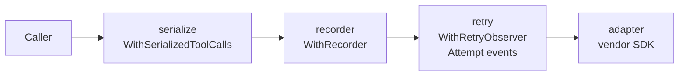

# Providers

The `provider` package is the single construction entry point for llmkit clients. Describe an endpoint with a `Spec`, tune the wrapper stack with `Options`, and call `provider.New`. This page shows one construction per provider type, the credential rules, and how errors normalize. See the [`provider` package reference](https://pkg.go.dev/github.com/dpoage/llmkit/provider).

## Constructing a client

Every construction follows the same shape:

1. Build a `provider.Spec` with the provider `Type`, the `Model`, and the resolved `Secret`.
2. Call `provider.New(ctx, spec, opts)`.
3. New validates the spec and returns a fully wrapped `llmkit.Client`.

New performs no network I/O and no environment lookups of its own. Construction is hermetic and testable with placeholder credentials. An invalid spec returns an error wrapping `llmkit.ErrInvalidRequest`; the error never echoes the secret.

### Anthropic

```go
spec := provider.Spec{
	Type:   provider.TypeAnthropic,
	Model:  "claude-sonnet-4-5",
	Secret: os.Getenv("ANTHROPIC_API_KEY"),
}
client, err := provider.New(context.Background(), spec, provider.Options{})
```

No `BaseURL` targets the vendor default, `api.anthropic.com`.

### OpenAI

```go
spec := provider.Spec{
	Type:   provider.TypeOpenAI,
	Model:  "gpt-4o",
	Secret: os.Getenv("OPENAI_API_KEY"),
}
client, err := provider.New(context.Background(), spec, provider.Options{})
```

No `BaseURL` targets the vendor default, `api.openai.com/v1`.

### OpenAI-compatible (Ollama, vLLM, Groq, ...)

```go
spec := provider.Spec{
	Type:    provider.TypeOpenAICompatible,
	Model:   "llama3.1",
	BaseURL: "http://localhost:11434/v1", // required
	Secret:  "ollama",                    // placeholder is fine
}
client, err := provider.New(context.Background(), spec, provider.Options{})
```

`BaseURL` is required for this type. It has no vendor default, so an empty value would silently target first-party `api.openai.com/v1`. New refuses an empty `BaseURL` with an error wrapping `ErrInvalidRequest`.

The endpoint is often credential-less, so pass any non-empty placeholder as `Secret` — for example the string `"ollama"`. New checks only that the secret is present, not that the backend accepts it.

Because llmkit cannot know what the endpoint supports, this provider uses a conservative capability profile:

- no parallel tool calls
- no caching
- no structured output
- no thinking

Override the profile with `Spec.Capabilities` — see [capabilities](capabilities.md).

### Google

```go
spec := provider.Spec{
	Type:   provider.TypeGoogle,
	Model:  "gemini-2.5-flash",
	Secret: os.Getenv("GEMINI_API_KEY"),
}
client, err := provider.New(context.Background(), spec, provider.Options{})
```

No `BaseURL` targets the vendor default, `generativelanguage.googleapis.com`.

## Base URL rules

`Spec.BaseURL` overrides the endpoint for tests, proxies, and self-hosted gateways. The vendor SDKs themselves also honor `ANTHROPIC_BASE_URL`, `OPENAI_BASE_URL`, and `GOOGLE_GEMINI_BASE_URL` when `Spec.BaseURL` is empty. An unset field can still route your secret to an ambient-configured host. Only `TypeOpenAICompatible` requires the field.

## Credentials

`Spec.Auth` selects the credential mode:

| Mode | Wire form | Providers |
|---|---|---|
| `provider.AuthAPIKey` (zero value) | The provider's standard API-key credential: the `x-api-key` header on Anthropic, an `Authorization: Bearer` token on OpenAI and openai-compatible, the `x-goog-api-key` header on Google | All |
| `provider.AuthOAuthToken` | OAuth bearer token (the `Authorization` header) | Anthropic only |

New refuses `AuthOAuthToken` on any other type with an error wrapping `ErrInvalidRequest`. New also refuses any unrecognized `Auth` value. There is no silent fallback to API-key mode.

`Spec.Secret` must be a non-empty value with no leading or trailing whitespace. New refuses empty, whitespace-only, or whitespace-padded values. New never logs the secret.

## Environment conventions in examples/

The example programs under `examples/` read four variables through `examples/internal/envcfg`:

| Variable | Meaning |
|---|---|
| `LLMKIT_PROVIDER` | `anthropic`, `openai`, `openai-compatible`, or `google` (required) |
| `LLMKIT_MODEL` | model identifier, e.g. `claude-sonnet-4-5` (required) |
| `LLMKIT_API_KEY` | provider API key; any placeholder for a local endpoint (required) |
| `LLMKIT_BASE_URL` | endpoint override; required for `openai-compatible`, optional otherwise |

With the variables unset, an example prints its usage and exits without touching the network.

## The decorator stack

`New` returns the adapter wrapped in three decorators, outer to inner:



The order decides who sees what:

- Usage is recorded only for the final successful attempt (the recorder sits outside the retry wrapper).
- The retry wrapper sees raw adapter errors, so its classification and `Retry-After` handling stay accurate.
- With `Options.Observer` set, the retry stage emits one `Attempt` event per wire call, failures included — it is the only layer that sees attempt boundaries.

All three decorators compose over streaming. Retry stops once a delta reaches the caller. The recorder reports the final streamed response. Serialization drops tool-call deltas for any index beyond the first.

`Options` tunes the stack:

| Field | Effect | Default |
|---|---|---|
| `Retry` | Retry policy for the retry wrapper. Unset fields (≤ 0; `Jitter` == 0) are completed field-wise from `retry.Default` via `retry.Config.Or`; every field you set is kept — `Retry{BaseDelay: 2s}` sleeps a 2 s-based schedule, `Retry{MaxAttempts: 2}` keeps the 500 ms base. | `retry.Default` fills every unset field: 4 attempts, 500 ms base delay, 30 s cap, 20% jitter, 5 m per-attempt timeout |
| `Recorder` | Receives a `llmkit.UsageEvent` after each successful completion. | nil (no recording) |
| `Observer` | Receives one `llmkit.AttemptEvent` per provider attempt (failures included) from the retry stage, tagged with the resolved provider name and model. `New` emits no `Completion` events — see the next section. | nil (no attempt events) |
| `Provider` | Overrides the provider tag on usage and attempt events; set it when your ledger keys on a config name. | `string(spec.Type)` |
| `HTTPClient` | Overrides the transport the SDKs use; for `httptest` and proxies. | SDK default |

## Observing completions and attempts

`Options.Observer` puts an `llmkit.Observer` inside the retry stage. The observer receives one `Attempt` event per wire call — failures included — numbered from 1.

A sink can watch flakiness without counting spend twice. `New` never emits `Completion` events: the outermost layer owns that one.

For a bare client, wrap the constructed client with `llmkit.Observe`. It emits exactly one `Completion` event per logical call. The event carries:

- the request as received
- the final response, or the error text
- on the stream path, the response assembled from the same synthesis `llmkit.Stream` performs

```go
spec := provider.Spec{Type: provider.TypeAnthropic, Model: "claude-sonnet-4-5", Secret: os.Getenv("ANTHROPIC_API_KEY")}
var events []llmkit.Event
obs := llmkit.ObserverFunc(func(ctx context.Context, ev llmkit.Event) {
    events = append(events, ev)
})
opts := provider.Options{Observer: obs}
client, err := provider.New(ctx, spec, opts)
// provider.Tag(spec, opts) is the tag New itself derives, so one span never
// carries two provider identities.
observed := llmkit.Observe(client, obs, provider.Tag(spec, opts), spec.Model)
```

`llmkit.Observe` mints a fresh span per logical completion and stamps it into the context it hands the client. Every `Attempt` event joins its `Completion` event on `ev.SpanID`.

A nested completion (a tool calling the model) gets its own span.

Because the observer sits below the serializer, an `Attempt` event shows the raw adapter response. The `Completion` event shows the truncated response your loop sees.

The attempt emitter is `llmkit.WithRetryObserver(c, cfg, obs, provider, model)`. It works on ANY `llmkit.Client` — not only through `provider.New`.

If the same client runs inside an `agent.Runner`, do not wrap it with `llmkit.Observe`. The Runner emits `Completion` events itself (with `Step` set), and double-wrapping records every completion twice. Pass the durable sink to the Runner instead.

## Error normalization

Adapters map vendor failures onto the sentinel errors in `llmkit`; match them with `errors.Is` on the returned error. The `Kind` is derived from the HTTP status, with the response body disambiguating 400s:

| HTTP status / failure | `llmkit` kind | Retried by `WithRetry` |
|---|---|---|
| 429 | `ErrRateLimited` | Yes; carries `Retry-After` when the response supplies one |
| 401, 403 | `ErrAuth` | No |
| 413 | `ErrContextTooLong` | No |
| 400 with a context-length message ("prompt is too long", "context length", ...) | `ErrContextTooLong` | No |
| 400, other | `ErrInvalidRequest` | No |
| 529 | `ErrOverloaded` | Yes |
| Other 5xx (503 included) | `ErrServer` | Yes |
| Any other 4xx (404, 409, 422, ...) | `ErrInvalidRequest` | No |
| Google status below 400 (302 included) | `ErrServer` (genai exposes no vendor type) | Yes |
| In-band SSE error event on a committed 200 stream (Anthropic `error.type` / OpenAI body `error.type`) | classified by the vendor type, `StatusCode` 200 | `overloaded_error`/`server_error` → yes; `invalid_request_error` → no; unknown type → `ErrServer` (yes) |
| Transport failure (dial, reset, per-attempt timeout) | `ErrServer` with `StatusCode` 0, SDK error chained | Yes |
| Caller's context done (cancelled mid-call or during the retry backoff, or its deadline expired mid-attempt) | Adapters report a cancellation as a plain error chaining `context.Canceled`, never an `*llmkit.APIError`. When the caller's context is done as the retry stage returns, a retryable last error (a 503, or the `ErrServer` transport failure a caller deadline cuts short) is replaced by a plain error chaining `ctx.Err()` that carries its text; a terminal one (a 401, a stream callback's sentinel) is returned as-is | No — the result is never retryable under `llmkit.Classify` |

`Retry-After` is parsed on every status, not only 429/529: whenever a response carries the header and it parses, the error reports `HasRetryAfter` with `RetryAfter` set (a present zero means retry immediately). `llmkit.Classify` is the one retryability rule the table summarizes: cancellation first, then the retryable kinds `ErrRateLimited`/`ErrServer`/`ErrOverloaded`, everything else terminal.

Outcomes below 400 are body-parse-driven, not status-driven:

- Anthropic, OpenAI, and openai-compatible: a body that decodes as the vendor's completion object returns no error. A JSON error body decodes the same way; its error field is ignored. A body that fails to parse — empty, or an HTML page — returns an `ErrServer`-class error with status code 0, at any status including 200.
- Google: a non-2xx status at or above 400 returns the status-classified sentinel carrying that status; a status below 400 (302 included) returns `ErrServer` — retryable — because genai exposes no vendor type to classify by. A 200 with an unparseable body (HTML) returns an `ErrServer`-class error with status code 0; an empty 200 body returns no error.
- Anthropic SSE: a 200 stream that carries an `error` event classifies it in band by the event body's `error.type` (`overloaded_error` → `ErrOverloaded`, `invalid_request_error` → `ErrInvalidRequest`, unknown type → `ErrServer`), carrying the committed stream's `StatusCode` 200.
- OpenAI SSE: a `data:` line whose body carries an `error` object classifies the same way by `error.type`, also at `StatusCode` 200.

A refused pre-wire request (a `Capabilities` violation, a malformed block, an unknown role) also returns `ErrInvalidRequest` before any network call. See [capabilities](capabilities.md) for which profile fields refuse rather than drop. The `llmkit` package documentation lists the `APIError` fields.

Two `Retry-After` rules apply across the table.

First, the header is honored on every status that carries it, but only Anthropic and OpenAI can surface it: the Google SDK hides response headers, so Google errors report `HasRetryAfter` false and the retry wrapper falls back to exponential backoff. An OpenAI in-band error on a 200 stream is the same gap from the other side: the SDK's `StreamError` carries no headers, so no `Retry-After` surfaces there either.

Second, a `Retry-After` above `retry.Config.MaxDelay` is truncated to `MaxDelay` (30 s by default) — and jitter never pushes a backoff sleep past `MaxDelay` either.

The `decide` package parses `Retry-After` on every non-200 status and honors it on 429, any status 500 or above, and any non-200 status below 400. Its exact semantics are in [decide](decide.md).
