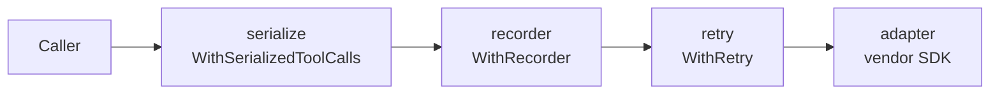

# Providers

The `provider` package is the single construction entry point for llmkit clients: you describe an endpoint with a `Spec`, tune the wrapper stack with `Options`, and call `provider.New`. This page shows one construction per provider type, the credential rules, and how errors normalize; see the [`provider` package reference](https://pkg.go.dev/github.com/dpoage/llmkit/provider).

## Constructing a client

Every construction follows the same shape:

1. Build a `provider.Spec` with the provider `Type`, the `Model`, and the resolved `Secret`.
2. Call `provider.New(ctx, spec, opts)`.
3. New validates the spec and returns a fully wrapped `llmkit.Client`.

New performs no network I/O and no environment lookups of its own, so construction is hermetic and testable with placeholder credentials. An invalid spec returns an error wrapping `llmkit.ErrInvalidRequest`; the error never echoes the secret.

### Anthropic

```go
spec := provider.Spec{
	Type:   provider.TypeAnthropic,
	Model:  "claude-sonnet-4-5",
	Secret: os.Getenv("ANTHROPIC_API_KEY"),
}
client, err := provider.New(context.Background(), spec, provider.Options{})
```

No `BaseURL` targets the vendor default, `api.anthropic.com`.

### OpenAI

```go
spec := provider.Spec{
	Type:   provider.TypeOpenAI,
	Model:  "gpt-4o",
	Secret: os.Getenv("OPENAI_API_KEY"),
}
client, err := provider.New(context.Background(), spec, provider.Options{})
```

No `BaseURL` targets the vendor default, `api.openai.com/v1`.

### OpenAI-compatible (Ollama, vLLM, Groq, ...)

```go
spec := provider.Spec{
	Type:    provider.TypeOpenAICompatible,
	Model:   "llama3.1",
	BaseURL: "http://localhost:11434/v1", // required
	Secret:  "ollama",                    // placeholder is fine
}
client, err := provider.New(context.Background(), spec, provider.Options{})
```

`BaseURL` is required: the type has no vendor default, and an empty one would silently target first-party `api.openai.com/v1`. New refuses an empty `BaseURL` with an error wrapping `ErrInvalidRequest`. The endpoint is often credential-less, so pass any non-empty placeholder as `Secret` — for example the string `"ollama"`. New checks only that the secret is present, not that the backend accepts it. Because llmkit cannot know what the endpoint supports, this provider uses a conservative capability profile: no parallel tool calls, no caching, no structured output, no thinking. Override the profile with `Spec.Capabilities` — see [capabilities](capabilities.md).

### Google

```go
spec := provider.Spec{
	Type:   provider.TypeGoogle,
	Model:  "gemini-2.5-flash",
	Secret: os.Getenv("GEMINI_API_KEY"),
}
client, err := provider.New(context.Background(), spec, provider.Options{})
```

No `BaseURL` targets the vendor default, `generativelanguage.googleapis.com`.

## Base URL rules

`Spec.BaseURL` overrides the endpoint for tests, proxies, and self-hosted gateways. The vendor SDKs themselves also honor `ANTHROPIC_BASE_URL`, `OPENAI_BASE_URL`, and `GOOGLE_GEMINI_BASE_URL` when `Spec.BaseURL` is empty, so an unset field can still route your secret to an ambient-configured host. Only `TypeOpenAICompatible` requires the field.

## Credentials

`Spec.Auth` selects the credential mode:

| Mode | Wire form | Providers |
|---|---|---|
| `provider.AuthAPIKey` (zero value) | The provider's standard API-key credential: the `x-api-key` header on Anthropic, an `Authorization: Bearer` token on OpenAI and openai-compatible, the `x-goog-api-key` header on Google | All |
| `provider.AuthOAuthToken` | OAuth bearer token (the `Authorization` header) | Anthropic only |

New refuses `AuthOAuthToken` on any other type with an error wrapping `ErrInvalidRequest`. It also refuses any unrecognized `Auth` value. There is no silent fallback to API-key mode. `Spec.Secret` must be a non-empty value with no leading or trailing whitespace; New refuses empty, whitespace-only, or whitespace-padded values. New never logs the secret.

## Environment conventions in examples/

The example programs under `examples/` read four variables through `examples/internal/envcfg`:

| Variable | Meaning |
|---|---|
| `LLMKIT_PROVIDER` | `anthropic`, `openai`, `openai-compatible`, or `google` (required) |
| `LLMKIT_MODEL` | model identifier, e.g. `claude-sonnet-4-5` (required) |
| `LLMKIT_API_KEY` | provider API key; any placeholder for a local endpoint (required) |
| `LLMKIT_BASE_URL` | endpoint override; required for `openai-compatible`, optional otherwise |

With the variables unset, an example prints its usage and exits without touching the network.

## The decorator stack

`New` returns the adapter wrapped in three decorators, outer to inner:



The order decides who sees what:

- Usage is recorded only for the final successful attempt (the recorder sits outside the retry wrapper).
- The retry wrapper sees raw adapter errors, so its classification and `Retry-After` handling stay accurate.
- Models without parallel tool calls have their multi-call responses truncated to one call before your loop sees them (`WithSerializedToolCalls` is a no-op on parallel-capable providers, so wrapping unconditionally is safe).

All three decorators compose over streaming: retry stops once a delta is delivered, the recorder reports the final streamed response, and serialization drops tool-call deltas for any index beyond the first.

`Options` tunes the stack:

| Field | Effect | Default |
|---|---|---|
| `Retry` | Retry policy for `WithRetry`. A zero `MaxAttempts` selects the default policy. | 4 attempts, 500 ms base delay, 30 s cap, 20% jitter, 5 m per-attempt timeout (`llmkit.DefaultRetryConfig`) |
| `Recorder` | Receives a `llmkit.UsageEvent` after each successful completion. | nil (no recording) |
| `Provider` | Overrides the provider tag on usage events; set it when your ledger keys on a config name. | `string(spec.Type)` |
| `HTTPClient` | Overrides the transport the SDKs use; for `httptest` and proxies. | SDK default |

## Error normalization

Adapters map vendor failures onto the sentinel errors in `llmkit`; match them with `errors.Is` on the returned error. The `Kind` is derived from the HTTP status, with the response body disambiguating 400s:

| HTTP status | `llmkit` kind | Retried by `WithRetry` |
|---|---|---|
| 429 | `ErrRateLimited` | Yes; Anthropic and OpenAI errors carry the `Retry-After` header value, and `WithRetry` honors it |
| 401, 403 | `ErrAuth` | No |
| 413 | `ErrContextTooLong` | No |
| 400 with a context-length message ("prompt is too long", "context length", ...) | `ErrContextTooLong` | No |
| 400, other | `ErrInvalidRequest` | No |
| 529 | `ErrOverloaded` | Yes (same `Retry-After` rules as 429) |
| Other 5xx | `ErrServer` | Yes |
| Any other 4xx (404, 409, 422, ...) | `ErrInvalidRequest` | No |
| Transport failure (timeout, connection reset) | `ErrServer` | Yes |

Outcomes below 400 are body-parse-driven, not status-driven:

- Anthropic, OpenAI, and openai-compatible: a body that decodes as the vendor's completion object returns no error (a JSON error body decodes the same way; its error field is ignored). A body that fails to parse — empty, or an HTML page — returns an `ErrServer`-class error with status code 0, at any status including 200.
- Google: any non-2xx status returns `ErrInvalidRequest` carrying that status (302 included). A 200 with an unparseable body (HTML) returns an `ErrServer`-class error with status code 0; an empty 200 body returns no error.
- Anthropic SSE: a 200 stream that carries an error event returns `ErrInvalidRequest`.

A refused pre-wire request (a `Capabilities` violation, a malformed block, an unknown role) also returns `ErrInvalidRequest` before any network call. See [capabilities](capabilities.md) for which profile fields refuse rather than drop, and the `llmkit` package documentation for the `APIError` fields.

Two `Retry-After` rules apply across the table. First, only Anthropic and OpenAI surface the header: the Google SDK hides response headers, so Google errors carry `RetryAfter` 0 and the retry wrapper falls back to exponential backoff. Second, a `Retry-After` above `RetryConfig.MaxDelay` is truncated to `MaxDelay` (30 s by default).
