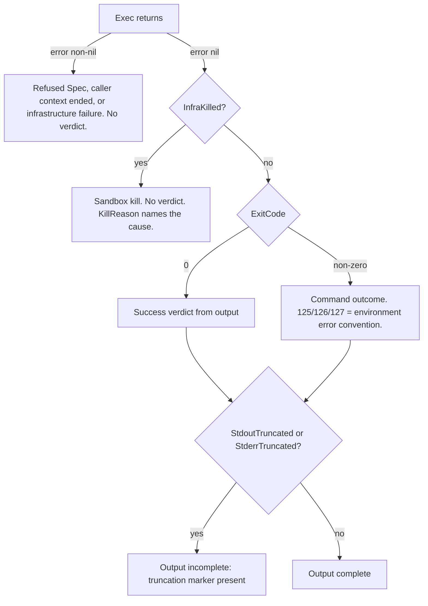

# Sandbox: untrusted command execution

The `sandbox` package runs untrusted, model-generated commands against repository snapshots. Four interchangeable backends implement one interface, so caller code never learns which one is behind it:

```go
type Sandbox interface {
	Exec(ctx context.Context, spec Spec) (Result, error)
	MaterializeWorkspace(repoDir string) (string, error)
}
```

Full API reference: [pkg.go.dev/github.com/dpoage/llmkit/sandbox](https://pkg.go.dev/github.com/dpoage/llmkit/sandbox).

## Getting started

A minimal run makes these calls, in order:

1. `Detect` or `DetectBwrap` reports whether a real backend exists on this host.
2. `NewCLI`, `NewBwrap`, `NewHostExec`, or `NewMock` constructs a backend. `NewMock` always works; the real backends need their host prerequisites.
3. `MaterializeWorkspace` (optional) creates one caller-owned workspace for repeated `Exec` calls. Without it, `Exec` copies a fresh workspace per call.
4. `Exec` runs the `Spec` to completion and returns a `Result`.
5. The caller checks `Result.InfraKilled` before reading `ExitCode` or output.

## Threat model

Untrusted inputs:

- The command argv (`Spec.Cmd`) — it comes from a model.
- The content of the repository snapshot — it may contain adversarial files, including symlinks.
- Content left in a reused workspace by an earlier untrusted run.

What the package defends:

- **The host repository.** `Exec` never mounts the original `RepoDir` read-write. Every run works on a copy in a fresh temporary directory.
- **The host filesystem.** By default the workspace copy is the only host surface the command can write; `Spec.RWMounts` are explicit exceptions. Writes into a workspace are symlink-hardened, so planted links cannot redirect a write or read onto the host.
- **The network.** Runs default to `NetworkNone`. The `none` mode leaves no DNS resolution and no egress in either container backend.
- **Host resources.** CPU, memory, and process caps bound every container-backed run. A watchdog bounds runtime, and output capture is capped.
- **Verdict integrity.** A run the sandbox killed never masquerades as a command result: `Result.InfraKilled` separates kills from verdicts.

What the package does NOT defend:

- **Read-only mounts leak their content.** Mount only public or cache content through `Spec.ROMounts`. Never mount secrets, credentials, or private trees. Untrusted code can read everything a caller mounts through `Spec.ROMounts`, and sandbox output flows back to the model.

- **Writable mounts are trusted surfaces.** Scope `Spec.RWMounts` entries to caller-owned directories. A compromised run can corrupt anything a caller mounts through `Spec.RWMounts`.
- **`Spec.Env` values are visible to the command.** Pass only values the command may read.

## Backends

| | Bwrap | CLI | HostExec | Mock |
|---|---|---|---|---|
| Isolation mechanism | Unprivileged user namespace: `--unshare-all`, sized tmpfs root, narrow read-only bind allowlist | Container namespace: read-only root, `--cap-drop ALL`, `no-new-privileges`, writable `/tmp` tmpfs | None — bare host process of the calling user | None — runs nothing, returns scripted results |
| Platform | Linux only | Any host with podman or docker | Any | Any |
| Detection call | `DetectBwrap` | `Detect` | none — explicit opt-in | none |
| Network modes honored | `none`, `host` | `none`, `host`, `bridge` | `""` (default), `host` | recorded, never enforced |
| `Image` honored | No — refused | Yes — required default, per-`Spec` override | No — refused | recorded only |
| Resource-cap mechanism | `systemd-run --user --scope` on systemd ≥ 254 (required for `--expand-environment=no`) or a delegated cgroup v2 subtree; `ErrBwrapNoCapMethod` without one (`CapBestEffort` opts out) | Runtime flags: `--cpus`, `--memory`, `--pids-limit` | none | none |

Bwrap checks the systemd version the first time an `Exec` finds a systemd user instance, and keeps the answer for the lifetime of that `Bwrap` value. The one exception is a check cut short because the caller's context ended; the next `Exec` checks again. A `systemd-run --version` probe that fails or times out counts as "no", so that `Bwrap` never uses `systemd-run`. It falls back to a delegated cgroup v2 subtree, or to `ErrBwrapNoCapMethod`. A new `Bwrap` probes again.

A backend refuses anything it cannot honor. The refusal point differs by stage:

- At construction, a misdirected option fails with a plain error that names the option and the backend. `errors.As` against `UnsupportedSpecError` does not match there.
- An impossible default network mode fails with `UnsupportedSpecError`.
- At `Exec`, an unsupported per-call `Spec` field fails with `UnsupportedSpecError` that names the backend, the field, and the value.

No backend silently runs a weaker posture than the `Spec` requested.

## Spec-field honor matrix

Honored / refused (`UnsupportedSpecError`) / recorded (Mock stores the value and runs nothing).

| Spec field | CLI | Bwrap | HostExec | Mock |
|---|---|---|---|---|
| `RepoDir` | honored — copied into a fresh workspace | honored — same | honored — same | recorded |
| `Workspace` | honored — used directly; must be absolute | honored — used directly; must be absolute | honored — used directly; must be absolute | recorded |
| `Cmd` | honored — required non-empty | honored — required non-empty | honored — required non-empty | recorded |
| `Env` | honored — `KEY=VALUE` list | honored | honored — appended to the host environment | recorded |
| `Image` | honored — overrides the default image | refused | refused | recorded |
| `Timeout` | honored — hard ceiling; backend default 10m | honored — same | honored — only kill; no backend default | recorded |
| `Network` | honored — `none`, `host`, `bridge` | honored — `none`, `host` | honored — `""`, `host`; `none`/`bridge` refused | recorded |
| `WriteFiles` | honored — written before the command | honored | honored | recorded |
| `ROMounts` | honored — read-only binds | honored — read-only binds (`Shared` has no SELinux effect) | refused | recorded |
| `RWMounts` | honored — writable binds | honored — writable binds | refused | recorded |
| `SetupCmds` | honored — `/bin/sh` wrapper, failed setup exits 125 | honored — same wrapper | refused | recorded |
| `CaptureFiles` | honored — read back after the run | honored | honored — same pre-run validation as the container backends | recorded |

The Mock column means the same thing in every row. `Mock.Exec` records the whole well-formed `Spec` verbatim and honors none of it — but it is not a law-free zone: it refuses a malformed `Spec` exactly like every backend, and its `MaterializeWorkspace` creates a real empty directory. It never copies `RepoDir` (it has nothing to run), and the caller removes the directory it returns.

## Validity rules (every backend, including Mock)

A `Spec` that violates any of these rules is refused at `Exec` with
`InvalidSpecError{Field, Reason}` (match with `errors.As`) before anything
is written or launched — on every backend, the Mock included:

1. `Cmd` must be non-empty.
2. One of `RepoDir` or `Workspace` must be set.
3. `Workspace`, when set, must be an absolute path. (The three real backends also require it to exist as a directory this process can enter — search permission — refused as `InvalidSpecError{Field: "Workspace"}` before the run; the Mock never checks.)
4. Every `WriteFiles` key must be a workspace-relative path that does not escape the workspace.
5. Every `CaptureFiles` entry must satisfy the same rule, before the run.
6. Every `ROMounts`/`RWMounts` entry must have a non-empty absolute `HostPath` and `ContainerPath`.
7. `ContainerPath` must be unique across `ROMounts` and `RWMounts` combined.
8. Every `Env` entry must be `KEY=VALUE` with a non-empty `KEY`. An entry without `=` would make the container backend inherit that name's value from the host environment — a host-env leak — and be silently dropped elsewhere; an empty key fails inside the run on the container backends. Both are refused everywhere.

`InvalidSpecError.Field` names the rule's field: `Cmd` (1), `RepoDir` (2), `Workspace` (3), `WriteFiles` (4), `CaptureFiles` (5), `ROMounts` or `RWMounts` (6: the list holding the bad mount; 7: the list holding the second occurrence of the duplicate, `ROMounts` checked first), `Env` (8).

A well-formed `Spec` field a single backend cannot honor is instead refused with `UnsupportedSpecError` (the rows above).

Two conventions apply across all container-backed runs:

- Exit codes 125, 126, and 127 mean "environment error, not a demonstrated result". A failed `SetupCmds` step exits 125 by design, so a broken setup cannot read as the command's own result.
- A mount's `ContainerPath` must be unique across `ROMounts` and `RWMounts` combined, and both mount paths must be absolute.

A command that cannot be **launched** reports the shell's convention on every real backend: `127` when it is missing and `126` when it is not executable, in `Result.ExitCode` with a nil error. Bwrap gets this through its always-on `/bin/sh` exec wrapper (with no `SetupCmds` the wrapper script is exactly `exec "$@"`); the exit codes reported on Bwrap below depend on which shell is bound as the sandbox's `/bin/sh`. HostExec maps the launch error to the exit code (a shebang-less 0755 script is `126` there, though it runs fine under bwrap's shell); the CLI backend reports whatever the runtime reports (a found-but-unloadable executable is exit `1` there — llmkit-bk8.1.18). Known HostExec divergences, where the host's exec call fails before any shell is involved: a command path that loops through symlinks (`ELOOP`) or is too long (`ENAMETOOLONG`), an empty `Cmd[0]`, and a bare name that resolves only through a relative `PATH` entry (Go's `exec.ErrDot`) are infrastructure errors on HostExec. On Bwrap, the same four failures reach the wrapper shell; bash reports `126`, `126`, `127`, and `126` for ELOOP, ENAMETOOLONG, `Cmd[""]`, and a shebang naming a missing interpreter; Debian dash reports `127`, `127`, `126`, and `127` for the same four. The core rule `127` missing / `126` not executable holds under both shells.

A command **killed by a signal** reports `128+signo` (SIGSEGV: `139`) with a nil error on every real backend; `-1` is reserved for the sandbox's own kills (timeout, idle watchdog, growth ceiling). One divergence: under the CLI backend `Spec.Cmd` is the container's PID 1, and the kernel drops a signal PID 1 has no handler for, so a command that signals itself (`sh -c 'kill -SEGV $$'`, `kill -KILL $$`) exits `0` there instead of `139`/`137`.

## Options

One `Option` type serves both option-taking constructors. A constructor refuses an option its backend cannot honor with a plain error that names the option and the backend. Only an impossible default network mode comes back as `UnsupportedSpecError`.

| Option | Accepted by | Default | Refusal |
|---|---|---|---|
| `WithRuntime(name)` | `NewCLI` | auto-detect: podman, then docker | — |
| `WithImage(image)` | `NewCLI` (required — `NewCLI` errors without it) | none | — |
| `WithCPUs(c)` | `NewCLI`, `NewBwrap` | 2 | `<= 0`, NaN, or ±Inf refused at construction |
| `WithMemoryMB(m)` | `NewCLI`, `NewBwrap` | 2048 MB | `<= 0` refused at construction |
| `WithTimeout(d)` | `NewCLI`, `NewBwrap` | 10m | `<= 0` refused at construction |
| `WithIdleTimeout(d)` | `NewCLI`, `NewBwrap` | 0 — idle watchdog disabled | 0 disables; negative refused |
| `WithNetwork(n)` | `NewCLI`, `NewBwrap` | `NetworkNone`; `bridge` on `NewBwrap` is a construction error | — |
| `WithPidsLimit(n)` | `NewCLI`, `NewBwrap` | 256 | 0 disables; negative refused |
| `WithMaxOutputBytes(n)` | `NewCLI`, `NewBwrap` | `DefaultMaxOutputBytes` (1 MiB per stream) | `<= 0` refused at construction |
| `WithScratchSizeMB(mb)` | `NewCLI`, `NewBwrap` | 512 MB | `<= 0` refused at construction |
| `WithWorkspaceGrowthCeilingMB(mb)` | `NewCLI`, `NewBwrap` | 2048 MB (2 GiB) | 0 disables; negative refused |
| `WithCapPolicy(p)` | `NewBwrap` | `CapRequired` — fail with `ErrBwrapNoCapMethod` when no mechanism exists | — |
| `WithHostToolchains(res)` | `NewCLI`, `NewBwrap` | none | — |

`NewHostExec` takes no options, and `NewMock` takes none either.

A constructor refuses a numeric value that names no usable limit. `WithCPUs` needs a positive finite number: it refuses 0, a negative value, NaN, and ±Inf. `WithMemoryMB`, `WithTimeout`, `WithScratchSizeMB`, and `WithMaxOutputBytes` refuse 0 and negative values. `WithPidsLimit`, `WithWorkspaceGrowthCeilingMB`, and `WithIdleTimeout` accept 0 as an explicit disable and refuse a negative value. The error names the option, its value, and the backend: `sandbox: option WithMemoryMB(0) must be > 0 on the cli backend`.

## Host toolchains

A sandbox image (or the Bwrap tmpfs root, which starts with none) that lacks a toolchain the run needs — node, python, cargo, ... — can still run it by mounting the equivalent host install read-only. Resolve once, then configure either backend with the result:

```go
res := sandbox.ResolveHostToolchains([]string{"node", "python3"})
if len(res.Unresolved) > 0 {
	log.Printf("host toolchains not found: %v", res.Unresolved) // best-effort, not fatal
}
for _, fp := range res.Fingerprints {
	log.Printf("toolchain %s: %s (%s)", fp.Name, fp.Version, fp.Path)
}

b, err := sandbox.NewBwrap(sandbox.WithHostToolchains(res))
// or: sandbox.NewCLI(sandbox.WithImage("img"), sandbox.WithHostToolchains(res))
```

- `ResolveHostToolchains(names)` resolves each entry into a read-only mount and a provenance fingerprint. A bare name resolves through the host's `PATH` and also contributes a `PATH` entry. An absolute directory is mounted as-is and contributes no `PATH` entry. Resolution is best-effort per entry: an entry that cannot be resolved on this host is skipped and its trimmed name reported in `Unresolved`, in request order; it never fails the whole call.
- `WithHostToolchains(res)` is the one option, accepted by both `NewCLI` and `NewBwrap`. The mount layout and how `PATH` is composed are each backend's own business — CLI renders `-v host:ctr:ro` plus `--env PATH=...` before any `Spec.Env` entry; Bwrap renders `--ro-bind` plus `--setenv PATH ...` — but in both cases an explicit `PATH` in `Spec.Env` still overrides.
- On `NewCLI`, a toolchain `PATH` entry replaces the image's own `ENV PATH`. The composed `PATH` is the toolchain directories followed by `/usr/local/sbin:/usr/local/bin:/usr/sbin:/usr/bin:/sbin:/bin`, so an image tool outside those directories is no longer found. For example, in `golang:1.23-alpine` with a bare-name host toolchain configured, `go version` exits 127. To keep such a tool, set `PATH` in `Spec.Env` to include the image's directories. A resolution with no `PATH` entry (only absolute directories) leaves the image's `ENV PATH` in effect.
- Caveat: a mounted host toolchain's shared-library closure must be loadable in the image or tmpfs root it lands in. A glibc host toolchain mounted into a musl-based image (or vice versa) will fail to exec even though the file is present. For an executable in the host's `/usr/bin`, the resolver mounts the whole host `/usr` (the parent of `bin`), not only the toolchain's own files (llmkit-bk8.7.4).

## Classifying a Result

Classify in this order. A wrong order misreads kills as verdicts.

1. An `Exec` error return: a refused `Spec` (`errors.As` to `InvalidSpecError` — fix the Spec — or `UnsupportedSpecError` — the backend cannot honor it), the caller's context ended (cancel or deadline: the `sandbox: execution cancelled` error, `errors.Is` to `ctx.Err()`), or an infrastructure failure (missing runtime, failed workspace copy). There is no verdict at all.
2. `Result.InfraKilled()`: the sandbox killed the run. `KillReason()` names the cause. Do not read `ExitCode` or output — the run never finished on its own.
3. `Result.ExitCode`: the command's own outcome. Apply the caller's own convention for 125/126/127 environment errors.
4. `Result.StdoutTruncated` / `Result.StderrTruncated`: the stream exceeded the cap; a truncation marker sits inside the captured text.



`InfraKilled` is true when either `TimedOut` or `WorkspaceQuotaExceeded` is set. The two flags are mutually exclusive: `TimedOut` covers the absolute timeout and the idle-stall kill; `WorkspaceQuotaExceeded` covers only the workspace-growth ceiling. Both report `ExitCode == -1`.

## Observing executions

`sandbox.Observe` wraps any backend so every `Exec` reports one `llmkit.Event` (kind `exec`) to an `llmkit.Observer` — the kit's run-correlated event stream. The wrapped backend behaves exactly like the unwrapped one: the `Result`, any error, and `MaterializeWorkspace` pass through unchanged.

The event mirrors [Classifying a Result](#classifying-a-result):

- The backend name. `cli`, `bwrap`, and `host` match `UnsupportedSpecError.Backend`. `mock` is the package's own name for the scripted backend, which refuses a malformed `Spec` exactly like every backend. Any other implementation is named by its Go type.
- `Spec.Cmd` (copied).
- The exit code, captured byte counts, truncation, `Result.Duration`, and `Err`: the text of the error `Exec` returned — a refused `Spec` (`InvalidSpecError`, `UnsupportedSpecError`), a caller context that ended (`sandbox: execution cancelled`), or an infrastructure failure. A non-zero exit arrives as the command's verdict with `Err` empty, and `-1` means the process never ran to an exit.
- `RunID` and `SpanID`, taken from the call's context.

The full field contract — including what stays zero — is the [`Observe` reference](https://pkg.go.dev/github.com/dpoage/llmkit/sandbox#Observe). This page does not restate it.

```go
b, err := sandbox.NewBwrap()
if err != nil {
	return err // or skip: no bwrap on this host
}
sb := sandbox.Observe(b, obs) // obs is your llmkit.Observer
if c, ok := sb.(io.Closer); ok {
	defer c.Close() // Close is not on the Sandbox interface. With a non-nil observer, Observe's return value always implements io.Closer: Close forwards to the wrapped backend's Close, or returns nil when the backend has none.
}

res, err := sb.Exec(ctx, sandbox.Spec{Cmd: []string{"go", "test", "./..."}})
```

The package's `ExampleObserve` shows a complete run against the Mock backend.

## Workspaces and symlink hardening

By default `Exec` copies the repository snapshot into a fresh temporary directory; it never works in the live checkout. With `Spec.Workspace` set, `Exec` uses that caller-owned directory directly instead of copying.

- When `RepoDir` is a git work tree, the copy contains exactly what git considers part of the work tree. Tracked files plus untracked, non-gitignored files are included. `.git` and generated gitignored content (for example, a stale build directory) never reach the sandbox. `GitWorktreeFiles` exposes the same listing to callers.
- When `RepoDir` is not a git work tree, `Exec` falls back to a full recursive copy.
- The container backends keep a one-entry pristine cache keyed by repository path, HEAD, and a `git status` hash. A cache hit clones the pristine copy (reflink-first) instead of re-walking the source. `Result.WorkspaceCacheHit` reports which happened. Non-git directories bypass the cache entirely.
- `MaterializeWorkspace` materializes one caller-owned workspace once. It creates the directory and returns its path. Pass the path as `Spec.Workspace` on repeated `Exec` calls. The caller removes it when done — `Exec` never deletes a caller-supplied workspace.

Every write into a workspace defends against links planted by the snapshot or by an earlier untrusted run:

1. `WriteFiles` keys pass a lexical check first: absolute paths and `..` escapes are rejected. `CaptureFiles` entries pass the same check before the run on every backend, so an escaping entry is refused instead of silently omitted.
2. Each write walks every parent component and refuses a symlinked directory. It creates missing directories one at a time — never `MkdirAll`, which would silently walk through a planted link.
3. The leaf file opens with `O_NOFOLLOW` on unix, so a planted symlink at the destination fails closed.
4. Capture reads back resolve the full path through `EvalSymlinks` and refuse anything that lands outside the workspace. A file the command never wrote is silently absent from `Result.Captured`; capture is best-effort, never a manifest.

## Watchdog

Every CLI and Bwrap run runs under a shared watchdog with two independent kill conditions. HostExec has no watchdog. By default, only the growth ceiling is active — the idle window's default is 0. With both conditions disabled, no watchdog runs at all.

**Idle window** (`WithIdleTimeout`): the run dies after this long with no observable progress. Progress is language-agnostic and layered cheapest-first. The layers run in order: bytes written to stdout/stderr, then any change in the workspace tree (size, entry count, newest mtime). The CPU probe runs only when both are flat. A compiler grinding silently on one large file still counts as active. The default is 0: the idle window is disabled, and only the absolute timeout and the growth ceiling bound a run.

**Growth ceiling** (`WithWorkspaceGrowthCeilingMB`): the run dies when the workspace's net regular-file size grows by more than the ceiling since the run started. A disk-filler resets the idle clock forever under the progress definition, so this check runs independently of it. The default is 2 GiB; 0 disables the ceiling, and the constructor refuses a negative value. A kill surfaces as `WorkspaceQuotaExceeded`, never as `TimedOut`, and the breach overrides the process's own exit code.

Sampling details:

- The idle check samples every `idlePollInterval`: clamped to [1s, 30s], derived from the window.
- The growth check samples once per second, a fixed cadence, whenever the ceiling is active. A slower tick would let a fast disk-filler overshoot the ceiling by tens of GB.
- `Exec` also runs one definitive growth check after the command exits. The post-run check catches a run that breaches the ceiling and finishes inside a single poll window.

Outcome precedence inside `Exec`: caller cancellation first, then a growth-ceiling breach, then the command's own exit code, then an idle-stall or absolute-timeout kill. This ordering keeps a genuine exit code safe from a watchdog firing in the same instant.

A quota breach always wins: it is measured final disk usage, not a heuristic.

## Capability probes

Before planning work against an unfamiliar sandbox, a caller can measure what it can actually run: `Probe(ctx, sb, base, probes)` runs the caller's `[]ProbeEntry` table against `sb` and returns a `CapabilitySet` mapping probe name to mode to availability.

- The kit ships no probe entries. What to probe, and how to interpret exit codes and stdout into named modes, is the caller's knowledge. `Probe` only runs the argv each entry supplies — every call re-runs every entry, with no cache.
- Each entry's `Exec` uses a copy of `base` with `Cmd` set to the entry's probe argv and `Timeout` defaulted to a fixed probe ceiling when `base.Timeout` is unset — every other `base` field (`Image`, `ROMounts`, `Env`, ...) reaches `sb.Exec` unchanged, so probing over `Observe(sb, obs)` or `sb` directly sends identical Specs.
- A refusal (`errors.As` to `*InvalidSpecError` or `*UnsupportedSpecError`) is returned as an error — `Probe` gives up rather than guessing at a set that was never run. Any other `Exec` error marks that entry's every mode unavailable, best-effort, and `Probe` keeps going.
- `base.Image` must be empty on Bwrap and HostExec. Both backends refuse a non-empty `Image` with `UnsupportedSpecError`, so `Probe` returns that refusal at the first entry and runs no probe argv.
- `base` must set `RepoDir` or `Workspace`. With neither set, `Probe` returns `InvalidSpecError` (`one of RepoDir or Workspace must be set`). (This applies when the probe table is non-empty: an empty `probes` returns an empty `CapabilitySet` and a nil error.)
- A nil `sb` is an error: `Probe` returns `sandbox: Probe requires a non-nil Sandbox`.
- To probe with host toolchains, construct the sandbox with `WithHostToolchains(res)`. Every `Exec` on that sandbox sees the toolchains, including each `Exec` that `Probe` makes.

Full reference: [`Probe`](https://pkg.go.dev/github.com/dpoage/llmkit/sandbox#Probe).

## sandbox and fsroot

The two packages defend different boundaries and share no code:

- **`sandbox`** confines the executed command's filesystem view: it decides what the command can see and write while it runs. This page is its guide.
- **[`fsroot`](https://pkg.go.dev/github.com/dpoage/llmkit/fsroot)** confines the caller's file tools. An `FSRoot` resolves tool-supplied, root-relative paths. It rejects absolute inputs, `..` escapes, and symlinks that point outside the root. It answers "may this tool open this path", not "may this process run".

Use both together: `fsroot` guards the agent tool layer before a command is planned; `sandbox` guards execution after it is planned.
