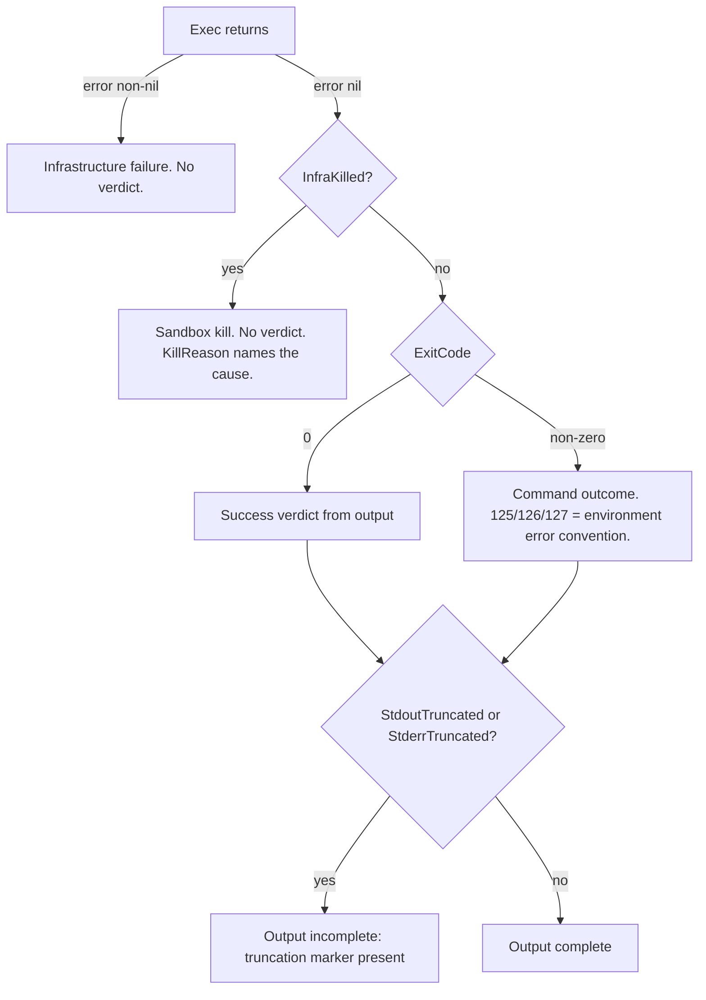

# Sandbox: untrusted command execution

The `sandbox` package runs untrusted, model-generated commands against repository snapshots inside one of four interchangeable backends. Every backend implements one interface, so caller code never learns which one is behind it:

```go
type Sandbox interface {
	Exec(ctx context.Context, spec Spec) (Result, error)
	MaterializeWorkspace(repoDir string) (string, error)
}
```

Full API reference: [pkg.go.dev/github.com/dpoage/llmkit/sandbox](https://pkg.go.dev/github.com/dpoage/llmkit/sandbox).

## Getting started

A minimal run makes these calls, in order:

1. `Detect` or `DetectBwrap` reports whether a real backend exists on this host.
2. `NewCLI`, `NewBwrap`, `NewHostExec`, or `NewMock` constructs a backend. `NewMock` always works; the real backends need their host prerequisites.
3. `MaterializeWorkspace` (optional) creates one caller-owned workspace for repeated `Exec` calls. Without it, `Exec` copies a fresh workspace per call.
4. `Exec` runs the `Spec` to completion and returns a `Result`.
5. The caller checks `Result.InfraKilled` before reading `ExitCode` or output.

## Threat model

Untrusted inputs:

- The command argv (`Spec.Cmd`) — it comes from a model.
- The content of the repository snapshot — it may contain adversarial files, including symlinks.
- Content left in a reused workspace by an earlier untrusted run.

What the package defends:

- **The host repository.** `Exec` never mounts the original `RepoDir` read-write. Every run works on a copy in a fresh temporary directory.
- **The host filesystem.** By default the workspace copy is the only host surface the command can write; `Spec.RWMounts` are explicit exceptions. Writes into a workspace are symlink-hardened, so planted links cannot redirect a write or read onto the host.
- **The network.** Runs default to `NetworkNone`. The `none` mode leaves no DNS resolution and no egress in either container backend.
- **Host resources.** CPU, memory, and process caps bound every container-backed run; a watchdog bounds runtime; output capture is capped.
- **Verdict integrity.** A run the sandbox killed never masquerades as a command result: `Result.InfraKilled` separates kills from verdicts.

What the package does NOT defend:

- **Read-only mounts leak their content.** Untrusted code can read everything a caller mounts through `Spec.ROMounts`, and sandbox output flows back to the model. Mount only public or cache content. Never mount secrets, credentials, or private trees.
- **`HostExec` is not isolation.** It runs the command as the calling OS user, with full network access and no caps. Use it only in attended, operator-opted-in paths where a human watches the exact command.
- **Writable mounts are trusted surfaces.** A compromised run can corrupt anything a caller mounts through `Spec.RWMounts`; scope those entries to caller-owned directories.
- **The bwrap root filesystem is a writable tmpfs.** It is fresh and size-bounded, but not read-only. The CLI backend's root, by contrast, is read-only with a writable `/tmp` scratch.
- **`Spec.Env` values are visible to the command.** Pass only values the command may read.

## Backends

| | Bwrap | CLI | HostExec | Mock |
|---|---|---|---|---|
| Isolation mechanism | Unprivileged user namespace: `--unshare-all`, sized tmpfs root, narrow read-only bind allowlist | Container namespace: read-only root, `--cap-drop ALL`, `no-new-privileges`, writable `/tmp` tmpfs | None — bare host process of the calling user | None — runs nothing, returns scripted results |
| Platform | Linux only | Any host with podman or docker | Any | Any |
| Detection call | `DetectBwrap` | `Detect` | none — explicit opt-in | none |
| Network modes honored | `none`, `host` | `none`, `host`, `bridge` | `""` (default), `host` | recorded, never enforced |
| `Image` honored | No — refused | Yes — required default, per-`Spec` override | No — refused | recorded only |
| Resource-cap mechanism | `systemd-run --user --scope` or a delegated cgroup v2 subtree; `ErrBwrapNoCapMethod` without one (`CapBestEffort` opts out) | Runtime flags: `--cpus`, `--memory`, `--pids-limit` | none | none |

A backend refuses anything it cannot honor. At construction, a misdirected option fails with a plain error naming the option and the backend — `errors.As` against `UnsupportedSpecError` does not match there. An impossible default network mode fails with `UnsupportedSpecError`. At `Exec`, an unsupported per-call `Spec` field fails with `UnsupportedSpecError` naming the backend, the field, and the value. No backend silently runs a weaker posture than the `Spec` requested.

## Spec-field honor matrix

Honored / refused (`UnsupportedSpecError`) / recorded (Mock stores the value and runs nothing).

| Spec field | CLI | Bwrap | HostExec | Mock |
|---|---|---|---|---|
| `RepoDir` | honored — copied into a fresh workspace | honored — same | honored — same | recorded |
| `Workspace` | honored — used directly; must be absolute | honored — used directly; must be absolute | honored — used verbatim | recorded |
| `Cmd` | honored — required non-empty | honored — required non-empty | honored — required non-empty | recorded |
| `Env` | honored — `KEY=VALUE` list | honored | honored — appended to the host environment | recorded |
| `Image` | honored — overrides the default image | refused | refused | recorded |
| `Timeout` | honored — hard ceiling; backend default 10m | honored — same | honored — only kill; no backend default | recorded |
| `Network` | honored — `none`, `host`, `bridge` | honored — `none`, `host` | honored — `""`, `host`; `none`/`bridge` refused | recorded |
| `WriteFiles` | honored — written before the command | honored | honored | recorded |
| `ROMounts` | honored — read-only binds | honored — read-only binds (`Shared` has no SELinux effect) | refused | recorded |
| `RWMounts` | honored — writable binds | honored — writable binds | refused | recorded |
| `SetupCmds` | honored — `/bin/sh` wrapper, failed setup exits 125 | honored — same wrapper | refused | recorded |
| `CaptureFiles` | honored — read back after the run | honored | honored — no pre-run validation; escapes silently omitted | recorded |

The Mock column means the same thing in every row: `Mock.Exec` records the whole `Spec` verbatim and honors none of it — it never touches the filesystem and returns scripted results.

Two conventions apply across all container-backed runs:

- Exit codes 125, 126, and 127 mean "environment error, not a demonstrated result". A failed `SetupCmds` step exits 125 by design so a broken setup can never read as the command's own demonstrated result.
- A mount's `ContainerPath` must be unique across `ROMounts` and `RWMounts` combined, and both mount paths must be absolute.

## Options

One `Option` type serves both option-taking constructors. A constructor refuses an option its backend cannot honor with a plain error naming the option and the backend; only an impossible default network mode comes back as `UnsupportedSpecError`.

| Option | Accepted by | Default |
|---|---|---|
| `WithRuntime(name)` | `NewCLI` | auto-detect: podman, then docker |
| `WithImage(image)` | `NewCLI` (required — `NewCLI` errors without it) | none |
| `WithCPUs(c)` | `NewCLI`, `NewBwrap` | 2 |
| `WithMemoryMB(m)` | `NewCLI`, `NewBwrap` | 2048 MB |
| `WithTimeout(d)` | `NewCLI`, `NewBwrap` | 10m |
| `WithIdleTimeout(d)` | `NewCLI`, `NewBwrap` | 0 — idle watchdog disabled |
| `WithNetwork(n)` | `NewCLI`, `NewBwrap` | `NetworkNone`; `bridge` on `NewBwrap` is a construction error |
| `WithPidsLimit(n)` | `NewCLI`, `NewBwrap` | 256; `<= 0` disables the cap |
| `WithMaxOutputBytes(n)` | `NewCLI`, `NewBwrap` | `DefaultMaxOutputBytes` (1 MiB per stream) |
| `WithScratchSizeMB(mb)` | `NewCLI`, `NewBwrap` | 512 MB; `<= 0` falls back to 512 |
| `WithWorkspaceGrowthCeilingMB(mb)` | `NewCLI`, `NewBwrap` | 2048 MB (2 GiB); `<= 0` disables the ceiling |
| `WithCapPolicy(p)` | `NewBwrap` | `CapRequired` — fail with `ErrBwrapNoCapMethod` when no mechanism exists |
| `WithToolchainBinds(mounts)` | `NewBwrap` | none beyond the fixed allowlist |
| `WithToolchainPath(prepend)` | `NewBwrap` | empty — no `PATH` prepend |

`NewHostExec` takes no options, and `NewMock` takes none either.

## Classifying a Result

Classify in this order. A wrong order misreads kills as verdicts.

1. An `Exec` error return: infrastructure failure (missing runtime, failed workspace copy, launch failure). There is no verdict at all.
2. `Result.InfraKilled()`: the sandbox killed the run. `KillReason()` names the cause. Do not read `ExitCode` or output — the run never finished on its own.
3. `Result.ExitCode`: the command's own outcome. Apply the caller's own convention for 125/126/127 environment errors.
4. `Result.StdoutTruncated` / `Result.StderrTruncated`: the stream exceeded the cap; a truncation marker sits inside the captured text.



`InfraKilled` is true when either `TimedOut` or `WorkspaceQuotaExceeded` is set. The two flags are mutually exclusive: `TimedOut` covers the absolute timeout and the idle-stall kill; `WorkspaceQuotaExceeded` covers only the workspace-growth ceiling. Both report `ExitCode == -1`.

## Workspaces and symlink hardening

By default `Exec` copies the repository snapshot into a fresh temporary directory; it never works in the live checkout. With `Spec.Workspace` set, `Exec` uses that caller-owned directory directly instead of copying.

- When `RepoDir` is a git work tree, the copy contains exactly what git considers part of the work tree: tracked files plus untracked, non-gitignored files. `.git` and generated gitignored content (for example, a stale build directory) never reach the sandbox. `GitWorktreeFiles` exposes the same listing to callers.
- When `RepoDir` is not a git work tree, `Exec` falls back to a full recursive copy.
- The container backends keep a one-entry pristine cache keyed by repository path, HEAD, and a `git status` hash. A cache hit clones the pristine copy (reflink-first) instead of re-walking the source; `Result.WorkspaceCacheHit` reports which happened. Non-git directories bypass the cache entirely.
- `MaterializeWorkspace` materializes one caller-owned workspace once: it creates the directory and returns its path. Pass the path as `Spec.Workspace` on repeated `Exec` calls. The caller removes it when done — `Exec` never deletes a caller-supplied workspace.

Every write into a workspace defends against links planted by the snapshot or by an earlier untrusted run:

1. `WriteFiles` keys pass a lexical check first: absolute paths and `..` escapes are rejected. The container backends apply the same check to `CaptureFiles` entries before the run. HostExec skips that pre-check; its hardened read-back (step 4) omits escaping paths silently.
2. Each write walks every parent component and refuses a symlinked directory, creating missing directories one at a time (never `MkdirAll`, which would silently walk through a planted link).
3. The leaf file opens with `O_NOFOLLOW` on unix, so a planted symlink at the destination fails closed.
4. Capture reads back resolve the full path through `EvalSymlinks` and refuse anything that lands outside the workspace. A file the command never wrote is silently absent from `Result.Captured`; capture is best-effort, never a manifest.

## Watchdog

Every CLI and Bwrap run runs under a shared watchdog with two independent kill conditions. HostExec has no watchdog. By default only the growth ceiling is active — the idle window's default is 0. With both conditions disabled, no watchdog runs at all.

**Idle window** (`WithIdleTimeout`): the run dies after this long with no observable progress. Progress is language-agnostic and layered cheapest-first: bytes written to stdout/stderr, then any change in the workspace tree (size, entry count, newest mtime), and only when both are flat a CPU probe — so a compiler grinding silently on one large file still counts as active. The default is 0: the idle window is disabled, and only the absolute timeout and the growth ceiling bound a run.

**Growth ceiling** (`WithWorkspaceGrowthCeilingMB`): the run dies when the workspace's net regular-file size grows by more than the ceiling since the run started. A disk-filler resets the idle clock forever under the progress definition, so this check runs independently of it. The default is 2 GiB; a value of 0 or less disables the ceiling. A kill surfaces as `WorkspaceQuotaExceeded`, never as `TimedOut`, and the breach overrides the process's own exit code.

Sampling details:

- The idle check samples every `idlePollInterval`: clamped to [1s, 30s], derived from the window.
- The growth check samples once per second, a fixed cadence, whenever the ceiling is active — a slower tick would let a fast disk-filler overshoot the ceiling by tens of GB.
- `Exec` also runs one definitive growth check after the command exits, catching a run that breaches the ceiling and finishes inside a single poll window.

Outcome precedence inside `Exec`: caller cancellation first, then a growth-ceiling breach, then the command's own exit code, then an idle-stall or absolute-timeout kill. This ordering keeps a genuine exit code safe from a watchdog firing in the same instant. A quota breach always wins: it is measured final disk usage, not a heuristic.

## Capability probes

Before planning work against an unfamiliar sandbox, a caller can measure what it can actually run. `ProbeCapabilities` executes the caller's `[]ProbeEntry` table inside the sandbox and returns a `CapabilitySet` mapping probe name to mode to availability.

- The kit ships no probe entries. What to probe, and how to interpret exit codes and stdout into named modes, is the caller's knowledge; the package only runs the argv and caches the answer.
- The result is cached per process. The cache key combines the image, the probe-set identity, and the mounts/env configuration, so two callers never share a wrongly shaped entry and a moved mount re-probes.
- Probes are best-effort: an `Exec` error or timeout marks every mode of that entry unavailable; the call never returns an error. A probe runs under the backend's default network mode — `none` on the container backends, host on HostExec — with a 30s ceiling.
- `InvalidateCapabilityCache(image)` forces a re-probe, mainly for tests.

Full reference: [`ProbeCapabilities`](https://pkg.go.dev/github.com/dpoage/llmkit/sandbox#ProbeCapabilities).

## sandbox and fsroot

The two packages defend different boundaries and share no code:

- **`sandbox`** confines the executed command's filesystem view: it decides what the command can see and write while it runs. This page is its guide.
- **[`fsroot`](https://pkg.go.dev/github.com/dpoage/llmkit/fsroot)** confines the caller's file tools: an `FSRoot` resolves tool-supplied, root-relative paths and rejects absolute inputs, `..` escapes, and symlinks that point outside the root. It answers "may this tool open this path", not "may this process run".

Use both together: `fsroot` guards the agent tool layer before a command is planned; `sandbox` guards execution after it is planned.
